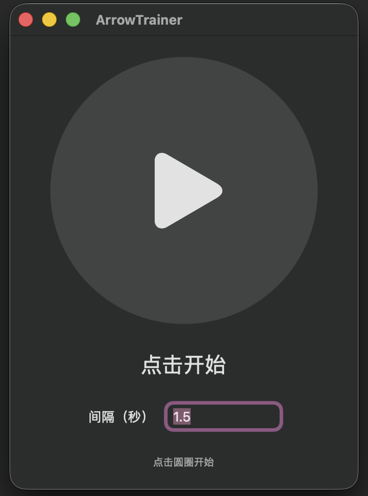
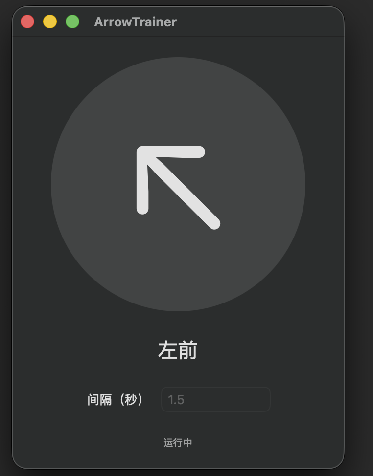

[ArrowTrainer](https://github.com/linstats/ArrowTrainer) is a lightweight app I built for indoor badminton footwork and reaction training. It gives a random movement cue at a chosen interval, so a player can practise seeing the cue, starting quickly, moving in the right direction, and returning to base.

## Interface preview

  <figure style="flex: 1 1 300px; max-width: 380px; margin: 0;">
    
    <figcaption style="margin-top: 8px; text-align: center;">Set an interval, then tap the circle to start.</figcaption>
  </figure>
  <figure style="flex: 1 1 300px; max-width: 380px; margin: 0;">
    
    <figcaption style="margin-top: 8px; text-align: center;">A random direction cue appears during training.</figcaption>
  </figure>

## How it works

Set the interval between direction changes, then tap the central circle to begin. The app randomly displays one of the six common movement directions:

- left front and right front
- left and right
- left rear and right rear

Tap the circle again during a session to pause; tap once more to continue. On macOS, hovering over the circle during training also reveals the pause control.

## Designed for simple, focused practice

ArrowTrainer is intended for individual, no-shuttle training sessions. It can be used for:

- indoor shadow-footwork practice
- pre-session warm-ups
- reaction-speed and directional-awareness drills

The interface is deliberately minimal: a large circular control, a clear direction cue, and one interval setting. It automatically follows the system light or dark appearance and supports both macOS and iOS.

## Project

The first version is built with SwiftUI and `Timer`. Its source code and setup instructions are available on GitHub:

[View ArrowTrainer on GitHub →](https://github.com/linstats/ArrowTrainer)

## Next steps

Potential future additions include a start countdown, configurable session duration, sound or voice cues, training statistics, and more difficulty levels.
