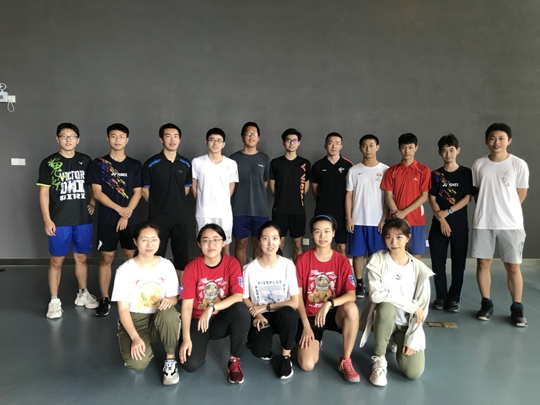
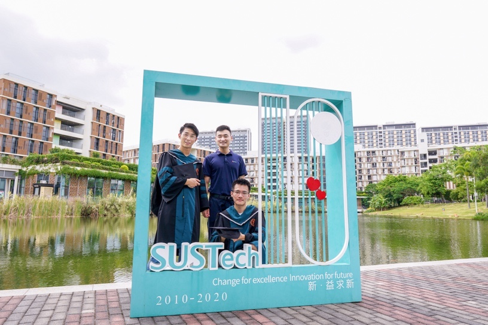
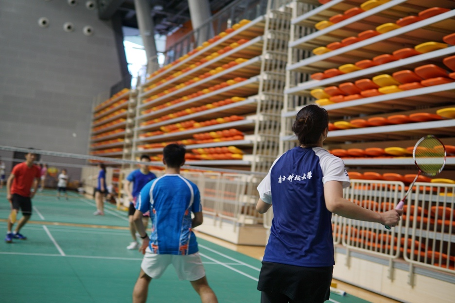
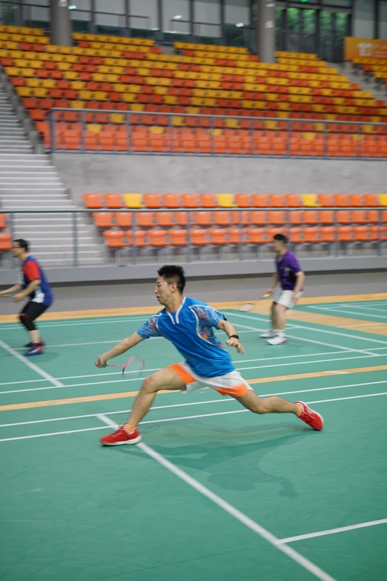
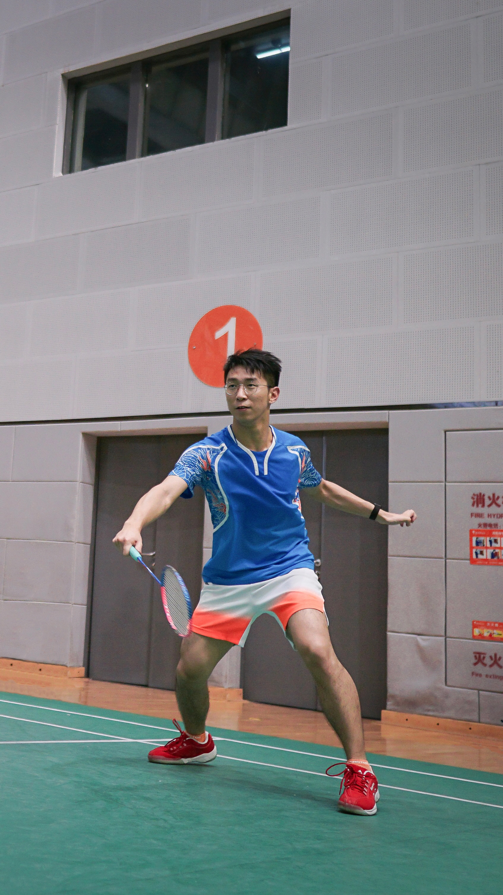
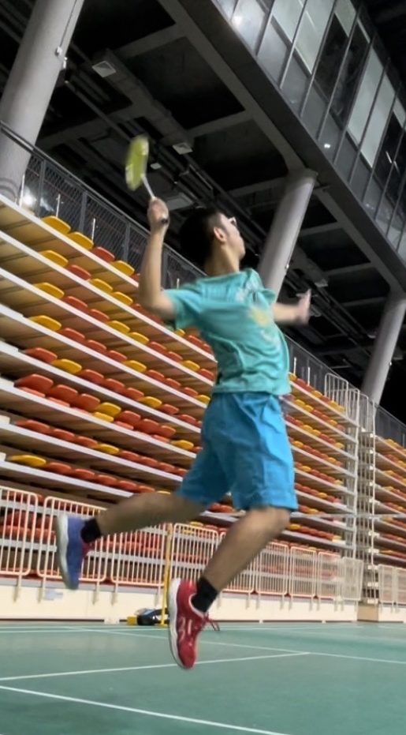

In 2019, I was fortunate to join the badminton team at the Southern University of Science and Technology, where I made a bunch of close friends there and focused on men's doubles, partnering with [Liu Chengyu](http://www.jiangxingyusustech.com/page131?article_id=64) (刘澄昱) and advised by both a advisor and a friend, Zhao Fei (赵飞).

|  |  |
|:-----------------------------:|:----------------------------:|
| Friend 1                      | Friend 2                     |

During my time on the team, I had the privilege of training under three exceptional coaches:

- [Sun Yu](https://bwfbadminton.com/player/92736/sun-yu) (孙瑜), a former world champion and professional badminton player,  
- [Zeng Yumin](http://sport.sustech.edu.cn/show-29-4-1.html) (曾煜民), a coach from the Guangdong Provincial Badminton Team.

Their expertise significantly enhanced my technical skills and strategic understanding of men's doubles badminton. Equally important were the bonds I formed with my friends, particularly the strong partnership I built with Liu Chengyu.

|  |  |  |
|:------------------------------:|:----------------------------------:|:----------------------------:|
| Lift                     | Defense                       | Smash                        |
