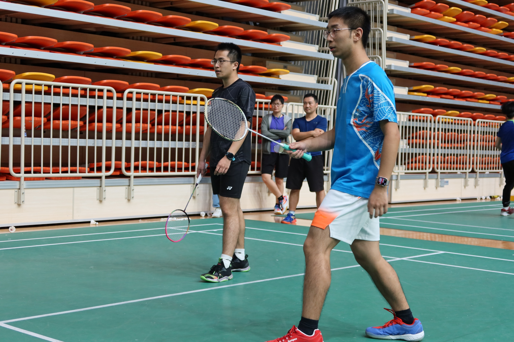
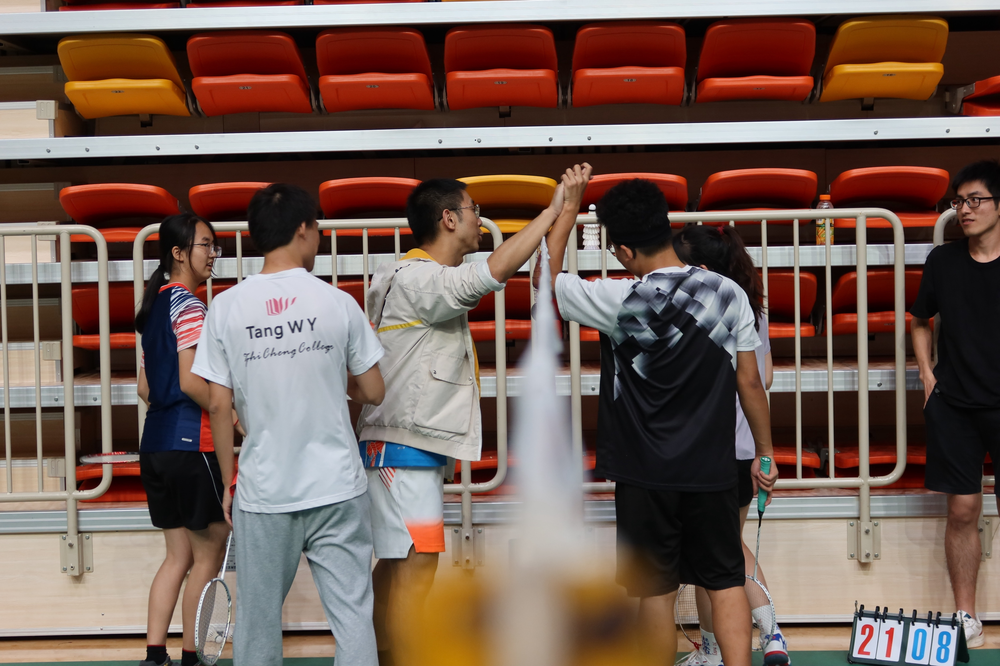

The most exciting moment of my badminton journey would be the 1st Badminton Tournament of the Faculty of Science at SUSTech in 2021, where I participated as both men's single and men's doubles player.

### Men's Single Game
The toughest moment of the tournament came unexpectedly early, during the quarterfinals. I found myself up against my senior teammate, Tang Wenyue (唐文跃), a skilled player on our campus team. Nerves got the best of me in the beginning, leading to several unforced errors and a significant 2:11 deficit. However, I managed to regain my composure and adjust my strategy. As I settled into the game, I fought back and eventually won the match 23:21.

  <video controls style="width: 48%;">
    <source src="images/bmt3-v5.mp4" type="video/mp4">
    Your browser does not support the video tag.
  </video>
  <video controls style="width: 48%;">
    <source src="images/bmt3-v6.mp4" type="video/mp4">
    Your browser does not support the video tag.
  </video>

### Men's Double Game
The men's doubles final was equally tough. My partner, Song Shuhao (宋舒昊), and I faced Zhou Jun (周俊) and Huang Weiming (黄惟明), both known for their powerful smash. It was a battle of defense and coordination as my partner and I worked together to hold off their offensive play.

|  |  |
|:-----------------------------:|:----------------------------:|
| Men's Double           | Game Interval        |

We did a good defense and comfort each other as partners. Finally we won the game.


