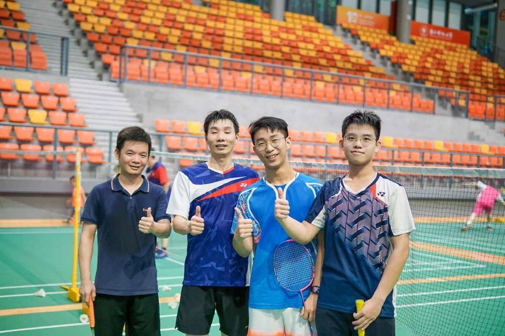
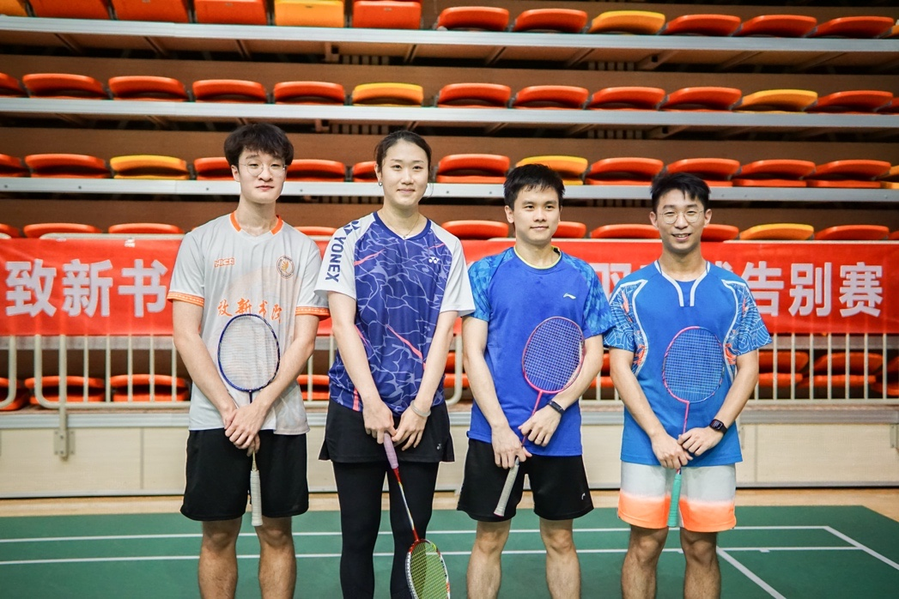
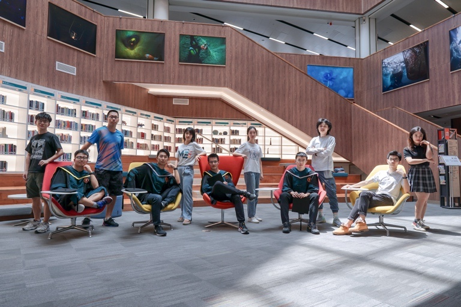
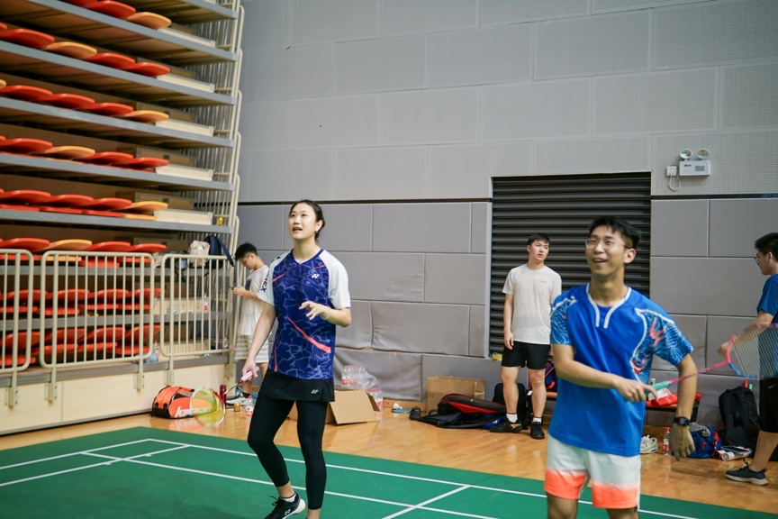
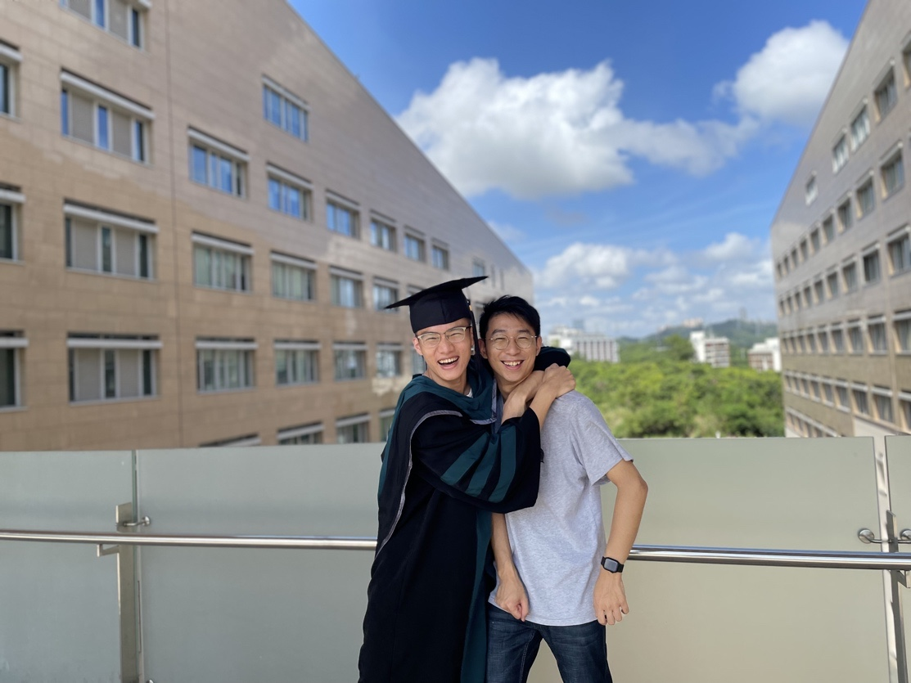
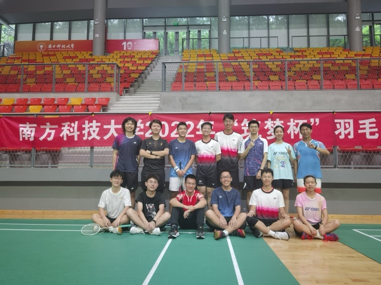
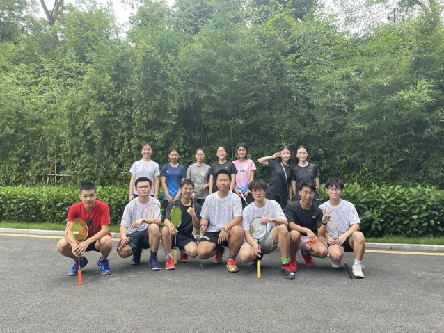

In the summer of 2022, I graduated from SUSTech, where I got trained and made lasting friendships. The farewell feels like it was just yesterday, and I often find myself reminiscing about these best days I spent at SUSTech, both on and off the badminton court.

  

    
  

  

    
  

  

    
  

  

    
  

  

    
  

  

    
  

  

    
  

  

    
  

