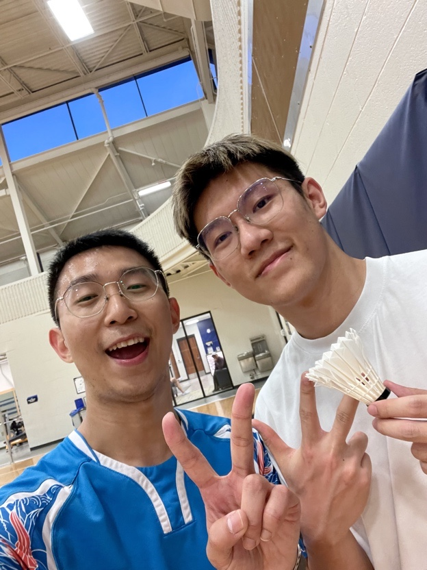
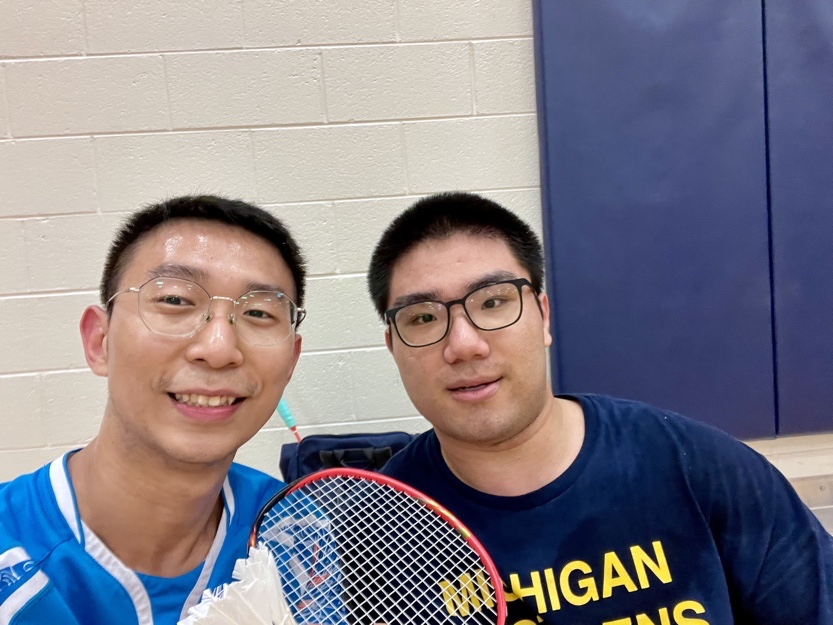

After graduating from my undergraduate studies, I moved to the United States to pursue my master's degree at the University of Michigan. Badminton once again became a way for me to connect with others, and I made many new friends through the sport. 

|  |  |
|:-----------------------------:|:----------------------------:|
| My Friend Zhang Youren (张又仁) | My Friend Cao Yanzhuo (曹彦卓) |

However, without the systematic training I was used to, I noticed a decline in my physical condition, which affected my ability to maintain the aggressive, hard-hitting style of play (偏硬的球风) I had developed. As a result, I made a conscious decision to adapt my game. 

I transitioned to a softer, more controlled style (偏软的球风), focusing on consistency in my strokes (击球动作一致性) and mastering control over the mid-to-back court (中后半场控制). This adjustment allowed me to continue enjoying the game while accommodating the changes in my physical endurance.

  <video controls style="width: 48%;">
    <source src="images/bmt5-v1.mp4" type="video/mp4">
    Your browser does not support the video tag.
  </video>
  <video controls style="width: 48%;">
    <source src="images/bmt5-v2.mp4" type="video/mp4">
    Your browser does not support the video tag.
  </video>

Reflecting on my time at Michigan, badminton has continued to be more than just a sport for me—it’s been a bridge to new friendships and a way to adapt and grow both physically and mentally.
