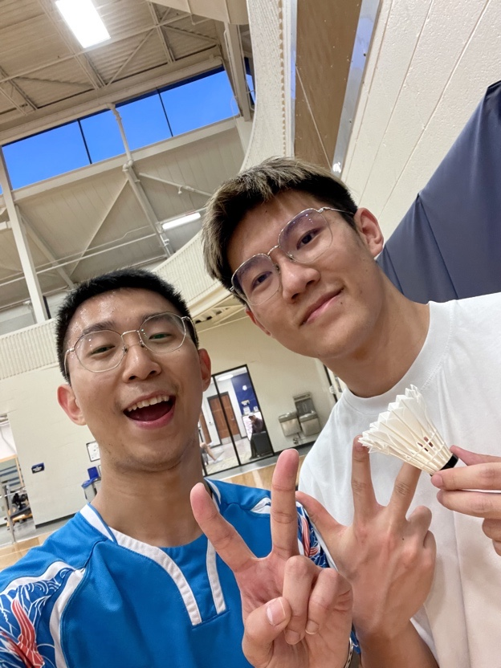
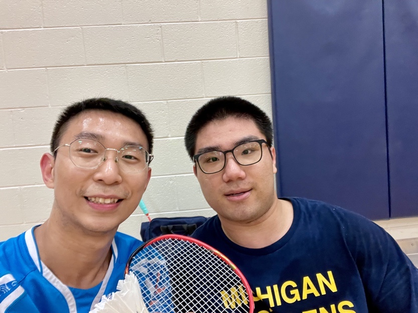

After moving to Ann Arbor for my master's study at the University of Michigan, badminton once again became an important part of my life. More than just a sport, it gave me a familiar way to meet people, build friendships, and settle into a new environment far from home.

This period also changed the way I played. Without the same level of systematic training as before, I gradually shifted from an aggressive, hard-hitting style to a softer and more controlled game, focusing more on consistency, placement, and mid-to-back court control.

  <video controls style="width: 100%;">
    <source src="images/bmt5-v2.mp4" type="video/mp4">
    Your browser does not support the video tag.
  </video>
  
A more controlled and rhythm-based playing style

Looking back, badminton in Ann Arbor was not only about improving or changing my game. It was also about friendship, adaptation, and finding a new rhythm in a different stage of life.

|  |  |
|:-----------------------------:|:----------------------------:|
| My Friend Zhang Youren (张又仁) | My Friend Cao Yanzhuo (曹彦卓) |