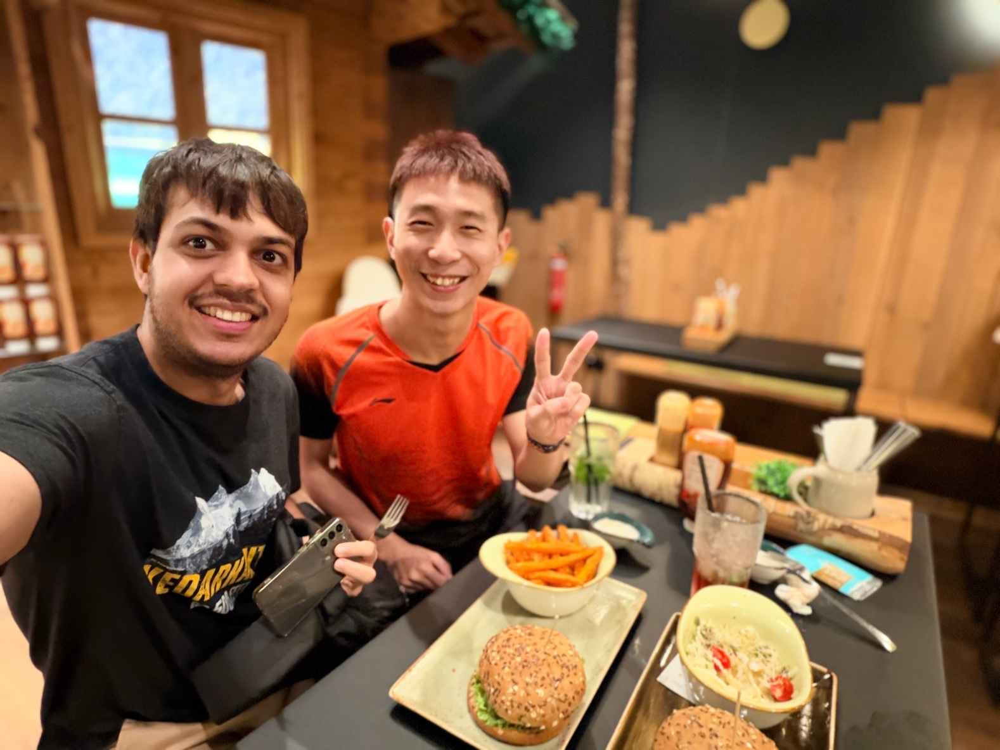
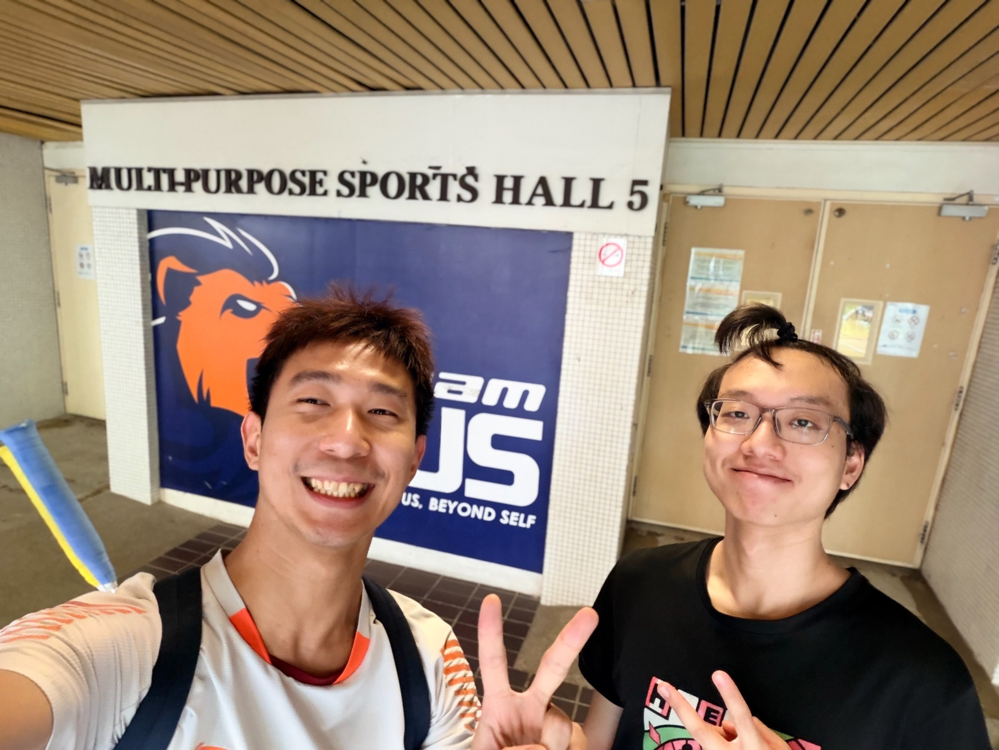
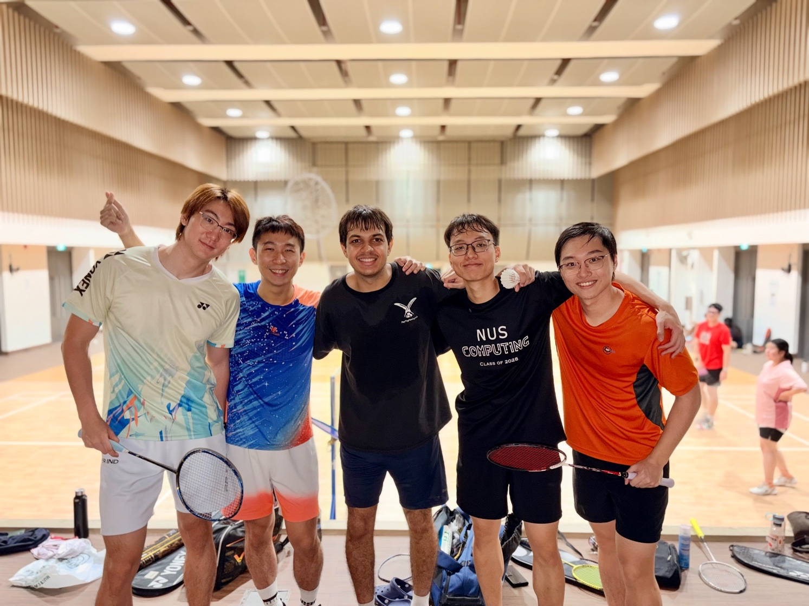
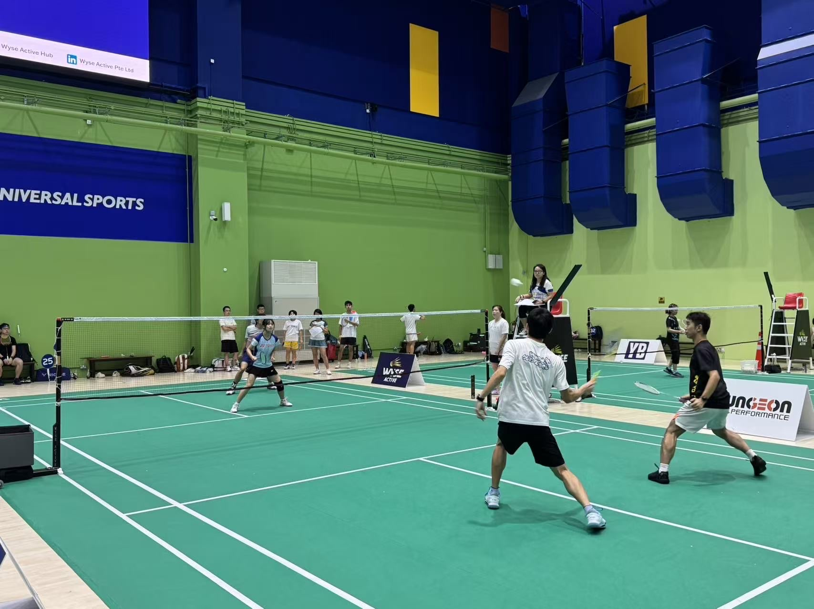
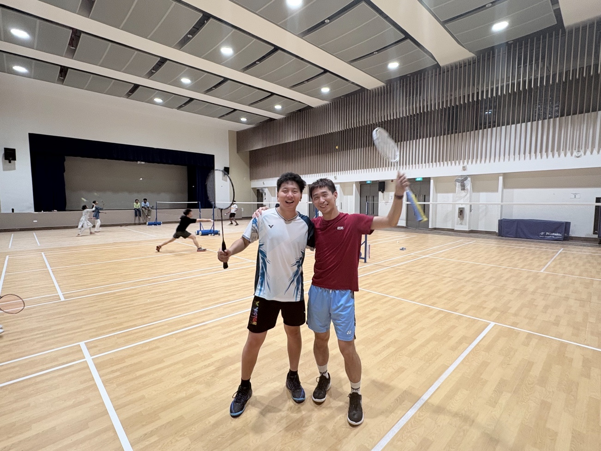
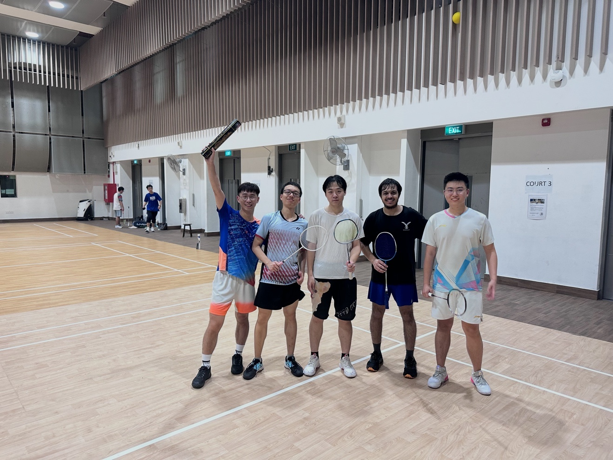
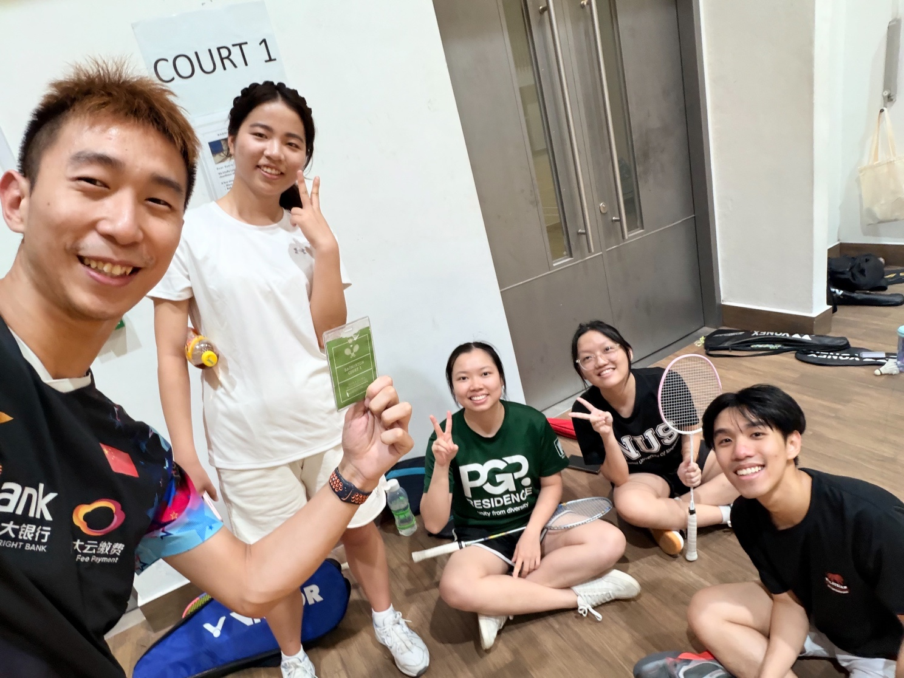
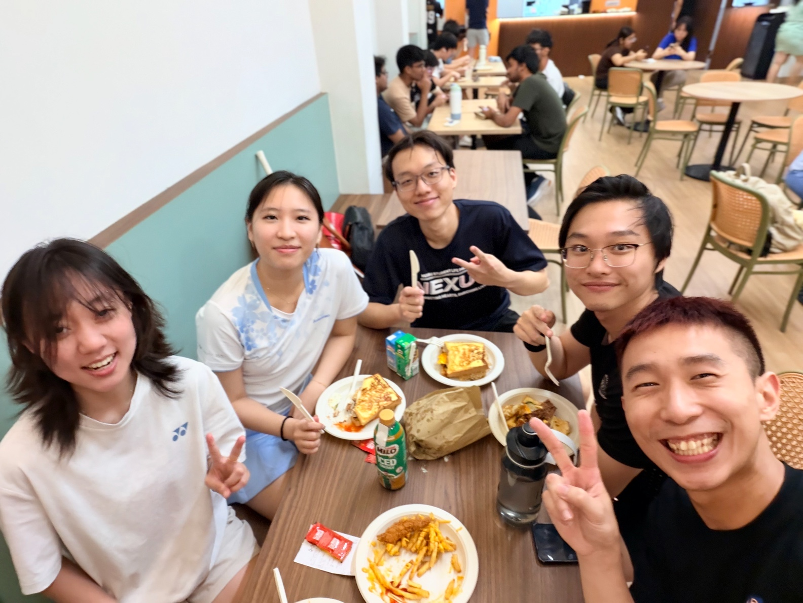

After arriving at NUS in the summer of 2024, badminton once again brought wonderful people into my life. Through the court, I became close friends with **Rishabh Batra** and **Song Yiyang**, and playing with them has been one of the happiest parts of my time in Singapore.

  

    
  

  

    
  

Playing singles with Rishabh is always a tough challenge for me. He plays at an incredibly fast pace. Every game against him pushes me to my limit, not only physically but also mentally, as I have to keep thinking about better shot choices. I am especially grateful that, among the many strong badminton players I have met, he is the first one who has consistently been willing to play with me. Through these games, I have learned a great deal from him, though I lost so badly that I smashed my racket ^_^. Over time, we have also built a close friendship. He even brought me to some of his favorite Indian and burger places.

Playing doubles with Yiyang has been another memorable part of my badminton life here. At first, I honestly thought this always-serious-looking player did not like me at all. But as time went on, we gradually got to know each other better, started talking more, smiling more, and discussing tactics both on and off the court. Whenever he is covering the back court, I always feel reassured.

  <video controls style="width: 100%;">
    <source src="images/bmt6-v1.mp4" type="video/mp4">
    Your browser does not support the video tag.
  </video>
  
Intense rallies with Rishabh

Over these two years, badminton has once again become the center of my social life. Many of my closest friends in Singapore come from the badminton community, and I feel deeply grateful that the sport has brought us together. The joy of meeting them, building these friendships, and sharing so many games on court has made this chapter of my life especially meaningful.

  

    
  

  

    
  

  

    
  

  

    
  

  

    
  

  

    
  

