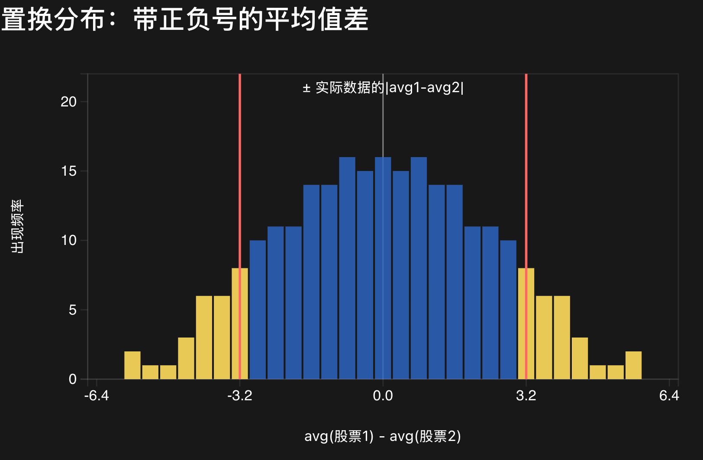
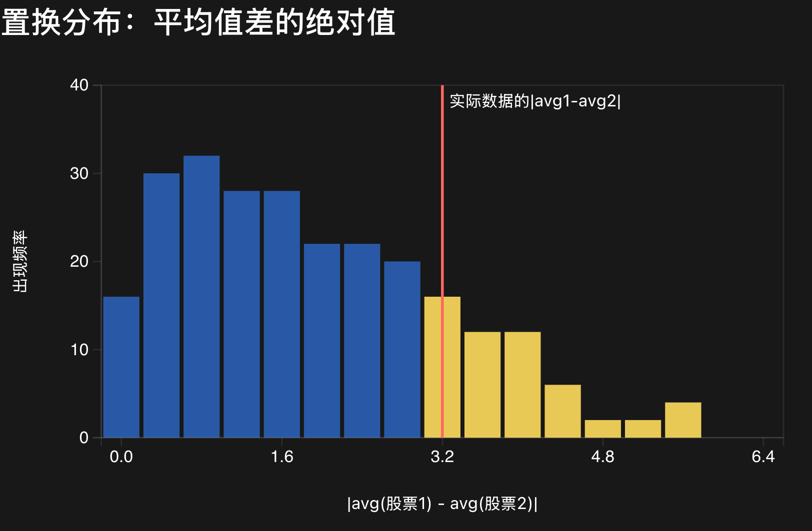

## What should we recalculate?

You may be wondering: **in a permutation test, what quantity should we use?** For example, if we want to test whether `avg(boys) = avg(girls)`, we could use

- `avg(boys) - avg(girls)`, or
- `avg(boys) ÷ avg(girls)`.

That is a good question because it has two parts: **what hypothesis are we trying to check, and which quantity helps us check it?** Let’s use a small stock-return example.

## Two stocks, five daily returns

Suppose the daily returns are:

| | Daily returns |
| --- | --- |
| Stock 1 | +1%, −2%, +3%, +2%, +5% |
| Stock 2 | −3%, −2%, +4%, +1%, −7% |

Our hypothesis is:

> **Hypothesis A:** In the long run, `avg(Stock 1) = avg(Stock 2)`.

## Option 1: the signed difference

We can use `avg(Stock 1) − avg(Stock 2)`. This quantity can be positive or negative. If Hypothesis A is true, we expect the permutation distribution to be centred around **0**, with positive and negative values on both sides:

After this, the rest is just like chicken wing example: decide what counts as extreme, then calculate the proportion of permutation results at least that extreme.

## Option 2: the absolute difference

We can also use `|avg(Stock 1) − avg(Stock 2)|`. This quantity is never negative. If Hypothesis A is true, we expect it to be **small**, so the permutation distribution looks different:

Here is a small challenge: **which part of this histogram should count as extreme?** Once we define “extreme,” we can again calculate the proportion of permutation results that are at least as extreme as the observed value. That proportion is our p-value.

## Why not use the ratio?

The ratio `avg(Stock 1) ÷ avg(Stock 2)` is less convenient here:

1. The two averages can be positive or negative, so the ratio can jump between positive and negative values.
2. Some returns are close to 0%. If a permutation average gets close to 0 in the denominator, the ratio can become enormous or unstable.

In theory, if the two means were equal and safely away from zero, we might expect `|avg(Stock 1) ÷ avg(Stock 2)|` to be around 1. But the sign changes and near-zero denominators make this statistic awkward for this example, so we set it aside.

## So, which quantity should we use?

There is no single fixed answer. It depends on the question we want to study: are we asking whether two groups have equal means, or whether one group’s mean equals a particular value such as 20 wings?

Under a given hypothesis, a quantity is useful when its permutation distribution has a pattern we can understand and use to define “extreme.” The two plots above show two reasonable choices for the same equality question; they simply require us to define extremeness in different ways.
