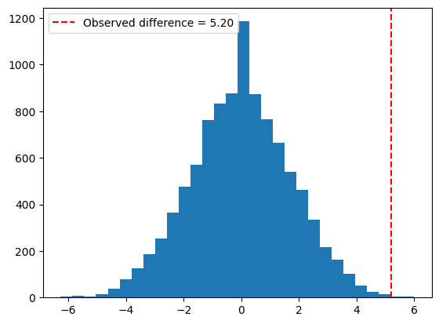
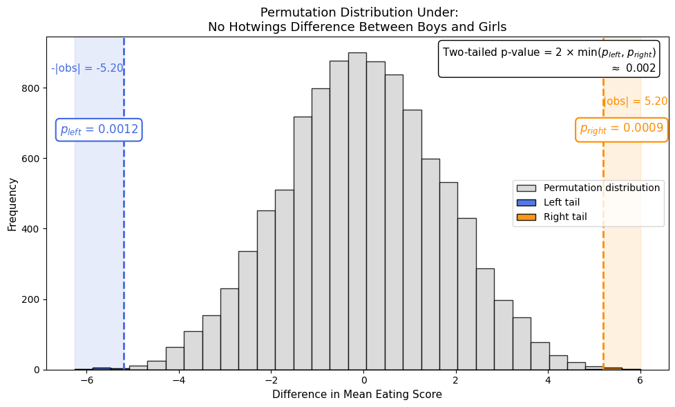
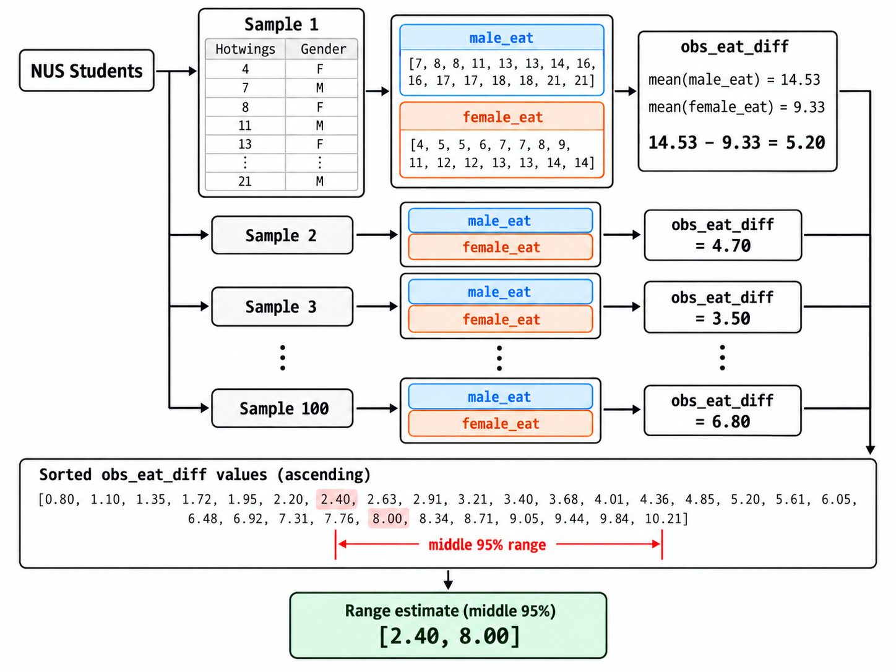

*Adapted from NUS DSA3361 Tutorial 3 — Inferential Data Analytics.*

Everyone loves chicken wings—including students at NUS! Imagine we asked a group of boys and girls how many chicken wings they could eat. Here are their answers:

| Group | Number of chicken wings |
| --- | --- |
| Boys | 7, 8, 8, 11, 13, 13, 14, 16, 16, 17, 17, 18, 18, 21, 21 |
| Girls | 4, 5, 5, 6, 7, 7, 8, 9, 11, 12, 12, 13, 13, 14, 14 |

**Who eats more chicken wings—boys or girls?** A difference in this sample is a starting point, but what can it tell us about the wider population?

We’ll use this example to explore two questions:

- **Is there evidence of a difference between the two groups?**
- **How can we estimate the size of that difference with a confidence interval?**

All you need to follow along is some basic Python. We’ll build the statistical ideas step by step 😊.

## A difference of 5.2 in our sample

Using these survey responses, let’s calculate the difference between boys’ and girls’ average chicken wing counts in our sample.

```python
import numpy as np
import matplotlib.pyplot as plt

male_eat = np.array([
    7, 8, 8, 11, 13, 13, 14, 16, 16, 17, 17, 18, 18, 21, 21
])
female_eat = np.array([
    4, 5, 5, 6, 7, 7, 8, 9, 11, 12, 12, 13, 13, 14, 14
])

obs_eat_diff = male_eat.mean() - female_eat.mean()
print(f"Male mean: {male_eat.mean():.2f}")
print(f"Female mean: {female_eat.mean():.2f}")
print(f"Observed difference: {obs_eat_diff:.2f}")
```

```text
Male sample mean: 14.53
Female sample mean: 9.33
Observed sample difference: 5.20
```

> In this sample, boys eat 5.2 more wings than girls on average. But we want to know whether this difference holds for boys and girls across NUS.

## A real difference — or just sampling variation?

To find out, let’s introduce permutation test.

### First, imagine a world with no systematic difference

Suppose boys and girls have the same distribution of hot wings consumption. In this imagined world, knowing how many wings someone eats gives us no information about their gender. The `M` and `F` labels are therefore **exchangeable**: we can randomly reassign them among the observed counts while keeping 15 boys and 15 girls.

### With that assumption, here is what we can do

(1) **Shuffle the labels.** Keep all 30 hot wings counts unchanged, but randomly reassign the gender labels: 15 observations receive `M`, and the remaining 15 receive `F`.

(2) **Recalculate the mean difference.** Using these new groups, calculate `avg(male_eat) - avg(female_eat)`.

(3) **Repeat many times.** Repeat steps (1) and (2) 10,000 times, then plot a histogram of the resulting mean differences. This shows what differences look like in our imagined no-difference world.

(4) **Locate our observed difference.** Where does our actual difference of **5.2** fall in this histogram? Would a difference this far from zero be unusual in this world?

<div style="display: flex; flex-wrap: wrap; align-items: center; gap: 1.5rem; margin: 1.5rem 0;">
  <div style="flex: 1.4 1 300px; min-width: 0;">
    
  </div>
  <div style="flex: 1 1 220px; min-width: 0;">
    <p><strong>Our observed difference of 5.2 is very extreme.</strong> Loosely speaking—but not quite correctly—we might say, “There is only about a 1-in-1,000 chance of this happening.”</p>
    <p>What exactly does that probability refer to? We’ll unpack this shorthand after the Python code. For now, let’s return to the main idea and see how to implement the permutation test.</p>
  </div>
</div>

Let’s briefly retrace the logic. We assumed that **H₀: NUS boys and girls eat about the same number of chicken wings.** Under H₀, the quantity `avg(male_eat) - avg(female_eat)` should follow a distribution like the one above. Yet our observed difference of **5.2** is way out on the right—roughly speaking, a result this large or larger happens only about **1‰** of the time. So, using this shorthand for now: **if there really were no systematic difference, we would have encountered a very rare result in just one sample.** There are two possible explanations:

- **We got suuuuper lucky** and happened to observe a very rare result.
- **Our original no-difference assumption is WRONG.**

Sure, we could just be lucky! But a result this unusual gives us **good reason to question our no-difference assumption**. And that’s the idea behind a permutation test. Makes sense?

### Then, the Python implementation

```python
# Sorting preserves the Hotwings order used in the tutorial dataset.
all_eat = np.sort(np.concatenate([male_eat, female_eat]))
male_num = len(male_eat)
all_index = np.arange(len(all_eat))

np.random.seed(123)
N = 10000
permuted_eat_diff = np.zeros(N)

for i in range(N):
    # (1) Shuffle labels: choose the observations assigned to males.
    permuted_male_index = np.random.choice(
        len(all_eat), size=male_num, replace=False
    )
    # The remaining observations are assigned to females.
    permuted_female_index = np.setdiff1d(
        all_index, permuted_male_index
    )

    # (2) Recalculate the mean difference.
    permuted_male_eat = all_eat[permuted_male_index]
    permuted_female_eat = all_eat[permuted_female_index]
    permuted_eat_diff[i] = (
        permuted_male_eat.mean() - permuted_female_eat.mean()
    )

# (3) Inspect the distribution of repeated differences.
plt.hist(permuted_eat_diff, bins=30, edgecolor="white")
plt.axvline(-abs(obs_eat_diff), color="royalblue", linestyle="--")
plt.axvline(abs(obs_eat_diff), color="darkorange", linestyle="--")
plt.xlabel("Difference in mean hot wings (male − female)")
plt.ylabel("Frequency")
plt.title("Permutation distribution under no systematic difference")
plt.show()
```

### Unpacking the code

**(1) Choose indices, then take the complement.** The code shuffles labels by randomly choosing which observations belong to the male group. It does not change anyone's hot wings count.

Here is a smaller, illustrative example with six observations and two male labels:

| Observation index | 0 | 1 | 2 | 3 | 4 | 5 |
| --- | --- | --- | --- | --- | --- | --- |
| Hot wings count | 4 | 7 | 5 | 6 | 11 | 9 |
| New label | F | F | M | F | M | F |

```text
all_index              = [0, 1, 2, 3, 4, 5]
permuted_male_index     = [2, 4]
permuted_female_index   = [0, 1, 3, 5]
```

`replace=False` makes every selected index distinct. `np.setdiff1d` finds the indices left over. Every observation therefore appears in exactly one group, once per permutation.

**(2) Use those indices to retrieve the counts and compute the statistic.**

```text
New male counts:       [5, 11]        → mean = 8.0
New female counts:     [4, 7, 6, 9]    → mean = 6.5
New mean difference:   8.0 − 6.5       = 1.5
```

**(3) Store one difference per repetition.** In the full example, each repetition uses 15 observations per group. `permuted_eat_diff[i]` stores its result; the histogram collects all 10,000 results.

### Finally, calculate the p-value

Earlier, we asked: **how strange is our observed difference of 5.2?** The number we use to answer that question is called the **p-value**. Now let’s make that idea a little more precise.

Under **H₀: no difference**, we expect `avg(boys) - avg(girls)` to be somewhere around **0**. A large positive difference would suggest that boys eat more; a large negative difference would suggest that girls eat more. **Either direction would challenge our no-difference assumption.**

So we use our observed **5.2** to set two cutoffs: **+5.2 and −5.2**. Looking at the histogram, what proportion of permutation results are **at least 5.2**, or **at most −5.2**? These are the two extreme tails we care about.

```python
# (4) Compute the two tail probabilities with an add-one correction.
abs_obs = abs(obs_eat_diff)
p_left = (np.sum(permuted_eat_diff <= -abs_obs) + 1) / (N + 1)
p_right = (np.sum(permuted_eat_diff >= abs_obs) + 1) / (N + 1)
p_value = min(2 * min(p_left, p_right), 1)

print(f"Two-sided permutation p-value: {p_value:.3f}")
```

```text
Two-sided permutation p-value: 0.002
```

Since our question is whether boys and girls differ at all, so we need to consider **both directions**. So, we turn the two tail probabilities into a **two-sided p-value**:


$$
p_{\text{value}} = 2\min(p_{\text{left}},\,p_{\text{right}}).
$$




For three optional follow-ups, see:

- [Why use `2 × min(p_left, p_right)` instead of `max`?](/teaching/dsa3361-tutorial-3/two-sided-p-value/)
- [Is a permutation distribution always bell-shaped?](/teaching/dsa3361-tutorial-3/permutation-distribution-shape/)
- [How do we choose the quantity for a permutation test?](/teaching/dsa3361-tutorial-3/choosing-test-statistic/)

> We now have strong evidence of a difference. But another sample might give us a number other than 5.2, so there’s some uncertainty in our estimate. Can we give a range instead?

## Bootstrap: a range estimate

If we had enough time and money, we could head out every day and survey a fresh group of students. After 100 days, we’d have **100 estimates** of the difference! We could line them up from smallest to largest and look at the **middle 95%** to see how much our estimates vary, as illustrated below. That’s the intuition we’ll build on to get a **confidence interval (a range estimate)** using bootstrap.



### Let’s save ourselves all that sampling!

But see the catch? If we keep heading out to collect new samples every day, we’ll still be doing surveys next year! Instead, we treat **our original sample as a miniature version of the NUS population** and sample from it **with replacement**. This is the bootstrap.

<details>
<summary>Why sample with replacement?</summary>

We want to mimic sampling from the whole NUS population. NUS is large, so picking one student barely changes who’s available for the next draw. But our “mini population”—Sample 1—is tiny! If we keep removing people without putting them back, it quickly shrinks, and the next draw becomes quite different. **Putting each observation back keeps our mini population unchanged for the next draw**, helping us mimic repeated draws from a much larger population.

</details>

<details>
<summary>What does it mean to sample someone twice?</summary>

It does not mean that a person actually answered a questionnaire twice. We are drawing from a distribution represented by the observed data. Repeating a count can be loosely imagined as sampling another person with similar eating behaviour.

</details>

<details>
<summary>Why did the permutation test use no replacement?</summary>

Because in a permutation test, we are not drawing a new set of observations like Bootstrap does. We are just shuffling the labels to see if our observed `avg(boys) - avg(girls)` looks unusually extreme.

So if the with/without replacement distinction still bothers you, a keynote is:

- **Bootstrap:** mimic taking new samples from the population.
- **Permutation test:** just reassign (shuffle) the labels — like shuffling a deck of cards.

</details>

### Then, the Python implementation

```python
np.random.seed(123)
N = 10000
boots_eat_diff = np.zeros(N)

for i in range(N):
    boots_male_eat = np.random.choice(
        male_eat, size=len(male_eat), replace=True
    )
    boots_female_eat = np.random.choice(
        female_eat, size=len(female_eat), replace=True
    )
    boots_eat_diff[i] = (
        boots_male_eat.mean() - boots_female_eat.mean()
    )

# The 2.5th and 97.5th percentiles leave 95% in the middle.
eat_diff_ci = np.quantile(boots_eat_diff, [0.025, 0.975])
print(f"Observed mean difference: {obs_eat_diff:.2f}")
print(f"95% bootstrap percentile CI: "
      f"[{eat_diff_ci[0]:.2f}, {eat_diff_ci[1]:.2f}]")
```

```text
Observed mean difference: 5.20
95% bootstrap percentile CI: [2.40, 8.00]
```

### Unpacking the code

| Code | What it does | Why it matters |
| --- | --- | --- |
| `np.random.choice(...)` | Randomly draws from the supplied observations | Reuses the data we already have |
| `replace=True` | Allows a count to be drawn repeatedly | The composition, and therefore the mean, can vary |
| `boots_male_eat.mean() - boots_female_eat.mean()` | Recalculates the same statistic | The direction remains male minus female |
| `np.quantile(..., [0.025, 0.975])` | Finds the endpoints of the middle 95% | Produces the percentile confidence interval |

The estimated difference is **5.2 hot wings**, with a **95% bootstrap percentile confidence interval of [2.4, 8.0] hot wings** for the population mean difference.

The interval expresses uncertainty in our estimate of the mean difference. It is not an interval containing 95% of individual people's consumption differences. Its confidence level refers to the approximate long-run coverage of this interval-building procedure under suitable sampling conditions.
