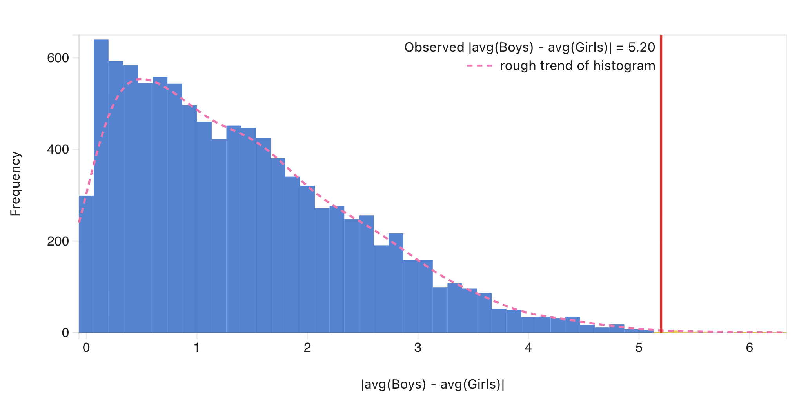

[← Tutorial 3 · Who Eats More Chicken Wings?](/teaching/dsa3361/tutorial-3/)

## A common misconception

Students sometimes connect permutation tests with the CLT, normal distributions, or bell-shaped histograms. Just one caution: a permutation distribution is **not necessarily bell-shaped**. Its shape depends on what we choose to recalculate.

In the main example, we use `avg(boys) - avg(girls)`. This statistic can be positive or negative, and its permutation distribution is centred around 0. But we could instead use `|avg(boys) - avg(girls)|`. This quantity is never negative, so its permutation distribution has a very different shape:

The key question is not whether the histogram looks normal. The key question is: **under the null assumption, which values would be considered extreme?**

Once “extreme” has been defined appropriately, we can calculate the p-value in the same spirit.
