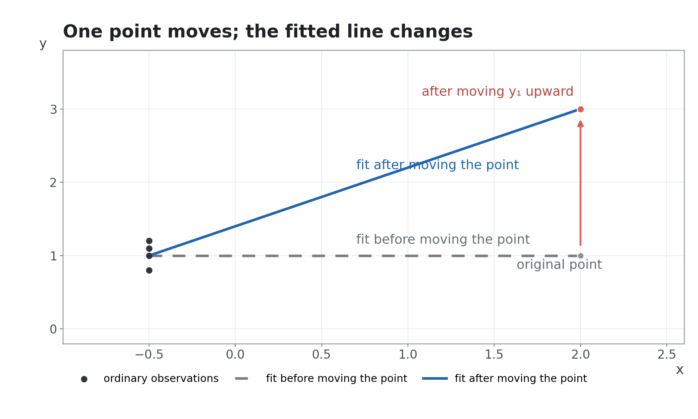

*Adapted from NUS DSA3361 Tutorial 4 — Inferential Data Analytics.*

When we first encounter regression, we often feel that estimating \(\hat{\beta}\) and obtaining the prediction equation \(\hat{y}=X\hat{\beta}\) should be enough. But courses usually do not stop there. We continue by looking more closely at the hat matrix \(H\), leverage values \(h_{ii}\), and related ideas.

> **Prerequisite:** the matrix form of linear regression, especially
>
> \(\hat{\beta}=(X^TX)^{-1}X^Ty\;\;\Rightarrow\;\;\hat{y}=X\hat{\beta}\;\;\Rightarrow\;\;H=X(X^TX)^{-1}X^T\).

We will answer two questions that may be on your mind:

- **Why do we call \(h_{ii}=H_{ii}\) leverage values? Or why it measures leverage?**
- **Why does \(h_{ii}\) matter when we analyse residuals?**

For simplicity, we will focus entirely on simple linear regression (SLR). Suppose that we have five observations: \((x_1,y_1), \ldots,(x_5,y_5),\)
and that the \(x\)'s have already been standardized, so that \(\operatorname{avg}(x)=0\) and \(\operatorname{std}(x)=1\).

Under this standardization, the two regression coefficients can be written as

\[
\hat{\beta}_1=\frac{1}{5}\sum_{j=1}^{5}x_jy_j\;\;\text{and}\;\;
\hat{\beta}_0=\bar{y}=\frac{1}{5}\sum_{j=1}^{5}y_j.
\]

Now imagine changing the response of observation \(i\): replace \(y_i\) with \(y_i+\Delta\), while leaving all the other values unchanged. Then

\[
\hat{\beta}_0\;\;\Rightarrow\;\;\hat{\beta}_0+\frac{\Delta}{5}\;\;\text{and}\;\;
\hat{\beta}_1\;\;\Rightarrow\;\;\hat{\beta}_1+\frac{x_i\Delta}{5}.
\]

If \(x_i\approx 0\), then moving \(y_i\) up or down has almost no effect on the slope. It only shifts the regression line a little. But if \(|x_i|\) is large, the same change \(\Delta\) produces a much larger change in the slope: \(\Delta\hat{\beta}_1=x_i\Delta / 5\).

<mark style="background-color: #fff3b0; color: #222;">This is the intuitive origin of the word leverage: the farther a point is from the centre of the \(x\)-values, the more leverage it has to pull and rotate the regression line.</mark>

But how much power can a point's leverage really have? \(h_{ii}\) gives us a useful answer: it measures how much the point pulls the fitted line toward **itself**.

## Why \(h_{ii}\) Measures Leverage?

Suppose we have already estimated \(\hat{\beta}\). If we want fitted values for all five original observations, the prediction equation \(\hat{y}=X\hat{\beta}\) tells us to plug the original \(X\) back in:

\[
\begin{pmatrix}\hat{y}_1\\\hat{y}_2\\\hat{y}_3\\\hat{y}_4\\\hat{y}_5\end{pmatrix}=\begin{pmatrix}1&x_1\\1&x_2\\1&x_3\\1&x_4\\1&x_5\end{pmatrix}\hat{\beta}=
X(X^TX)^{-1}X^T\begin{pmatrix}y_1\\y_2\\y_3\\y_4\\y_5\end{pmatrix}=H\begin{pmatrix}y_1\\y_2\\y_3\\y_4\\y_5\end{pmatrix}.
\]

In this example, \(H\) and \(h_{ii}\) are quite intuitive (I computed them for you):

\[
H=\frac{1}{5}
\begin{pmatrix}
1+x_1^2 & 1+x_1x_2 & \cdots & 1+x_1x_5 \\
1+x_2x_1 & 1+x_2^2 & \cdots & 1+x_2x_5 \\
\vdots & \vdots & \ddots & \vdots \\
1+x_5x_1 & 1+x_5x_2 & \cdots & 1+x_5^2
\end{pmatrix}
\;\;\Rightarrow\;\;
h_{ii}=\frac{1+x_i^2}{5}.
\]

If we focus on one of these fitted values, say the one for observation 1, then

\[
\hat{y}_1=h_{11}y_1+\cdots+h_{15}y_5
=\frac{(1+x_1^2)y_1+(1+x_1x_2)y_2+\cdots+(1+x_1x_5)y_5}{5}.
\]

Now the connection is visible:

\[
y_1\text{ changes by }\Delta
\;\;\Rightarrow\;\;
\hat{y}_1\text{ changes by }\frac{1+x_1^2}{5}\Delta.
\]

Clearly, the farther \(x_1\) is from the centre of the \(x\)-values, the more \(\hat{y}_1\) responds to a change in \(y_1\), and the stronger this self-pull becomes. For example:

- If \(x_1=2\), then \(h_{11}=(1+2^2)/5=1\). Moving \(y_1\) up by 1 unit changes \(\hat{y}_1\) by 1.
- If all other \(x_i=-0.5\), so other \(h_{ii}=(1+0.5^2)/5=0.25\). Moving \(y_i\) up by 1 unit changes \(\hat{y}_i\) by only 0.25.

The following figure may help make this idea more intuitive:

<mark style="background-color: #fff3b0; color: #222;">So we see that \(h_{ii}\) measures how strongly observation \(i\) can pull the fitted line toward itself.</mark> The larger \(h_{ii}\) is, the more strongly the observation can shift the line, just like the point with \(x_1=2\) moves the line noticeably above, pulling \(\hat{y}_1\) closer to \(y_1\), making its residual \(e_1=y_1-\hat{y}_1\) look smaller. High-leverage points can therefore partly hide their own residuals. This leads us to our final topic:

## Why does \(h_{ii}\) matter when we analyse residuals?

If \((x_1,y_1)\) is a high-leverage point, its fitted value \(\hat{y}_1\) is pulled toward \(y_1\). Its prediction may therefore look unusually accurate, with a smaller residual \(e_1=y_1-\hat{y}_1\). With a little matrix algebra, we can see why the residual is also less variable:

\[
\begin{aligned}
e&=y-\hat{y}=Iy-X\hat{\beta}\\
&=Iy-X(X^TX)^{-1}X^Ty=(I-H)y.
\end{aligned}
\]

Therefore, we find \(\operatorname{Cov}(e)=\sigma^2(I-H)\) or specifically \(\operatorname{Var}(e_1)=\sigma^2(1-h_{11})\). The larger the leverage \(h_{11}\), the smaller the variance of the first observation's residual. 

How about the others? If we add up all five leverage values, we get

\[
\sum_{i=1}^{5}h_{ii}
=\sum_{i=1}^{5}\frac{1+x_i^2}{5}
=\frac{5+\sum_{i=1}^{5}x_i^2}{5}
=\frac{5+5}{5}
=2.
\]

Mini-Challenge: Why is \(\sum_{i=1}^{5}x_i^2=5\)?

\[
\text{Initial assumption:}\;\;
\operatorname{std}(x)=1
\;\;\Rightarrow\;\;
\frac{1}{5}\sum_{i=1}^{5}x_i^2=1
\;\;\Rightarrow\;\;
\sum_{i=1}^{5}x_i^2=5.
\]

The total leverage power of all observations is fixed and limited! If \((x_1,y_1)\) has more power to pull the regression line, the other points have less power to pull it. As a result, the other residuals collectively have larger variance. This leads to the question:

> If we want to compare residuals, directly comparing the raw values \(e_1,\ldots,e_5\) is not quite fair, because their variability depends on its leverage.

The fix is quite simple. Since we know that \(\operatorname{Var}(e_i)=\sigma^2(1-h_{ii})\), we can standardize each residual by its own leverage-adjusted variability, replacing the unknown \(\sigma\) with the sample estimate \(s\). This gives the **studentized residual**:

\[
r_i:=
\frac{e_i}{s\sqrt{1-h_{ii}}}\;\;\text{where}\;
s=\sqrt{\frac{\sum_{j=1}^{n}e_j^2}{n-p}}\;\text{is an estimate of real std }\sigma.
\]

The resulting \(r_i\) has some very useful properties. For any observation \(i\), we have approximately \(E(r_i)=0\) and \(\operatorname{Var}(r_i)=1\). If we also assume normally distributed errors, then approximately \(r_i\sim N(0,1)\). This makes studentized residuals convenient for checking model assumptions, such as constant variance and normality. 

That is why the model-diagnostics sections in DSA3361 (`05 Model Diagnostics.pdf`) and ST3131 (`Topic 3 To Model Adequacy Checking.pdf`) pay particular attention to \(r_i\).
