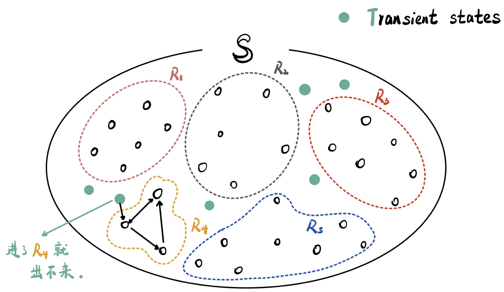

One of my favorite professors, [Cai Jingheng](https://math.sysu.edu.cn/scrcss/teacher/127) (蔡敬衡), once said: *“True discoveries or creations are not made by statisticians themselves, but by other scientists. Yet, almost all of them rely on an indispensable tool: statistics.”* I like this word and believe that the power of statistics lies not only in its mathematical rigor but in its ability to help us make sense of the world. I find much joy in sharing statistical concepts with others—whether with friends, peers, roommates, or family—and I am committed to promoting the broad application of statistical methods across diverse fields.

One of the most effective ways I’ve found to teach statistics is through **visualization**. By turning abstract statistical concepts into visual representations, complex ideas become more intuitive and easier to grasp. Visuals can break down barriers for people unfamiliar with mathematics, allowing them to engage with and understand key statistical ideas. For example, the **state space decomposition** of a discrete Markov chain—a concept that can seem abstract at first—becomes far more tangible with visualization:
|  |  |
|:-----------------------------:|:----------------------------:|
| Math Statement           | Visualized Interpretation        |

Similarly, we can visualize the idea of **support vector machines (SVM)**, another widely used statistical method, to highlight how these algorithms create decision boundaries in classification problems:
|  |  |
|:-----------------------------:|:----------------------------:|
| Math Statement           | Visualized Example        |

In my philosophy of teaching and using statistics, the key is to **simplify** without losing the depth of the subject, by making concepts more **accessible** through visualization and emphasizing the practical impact of statistics.