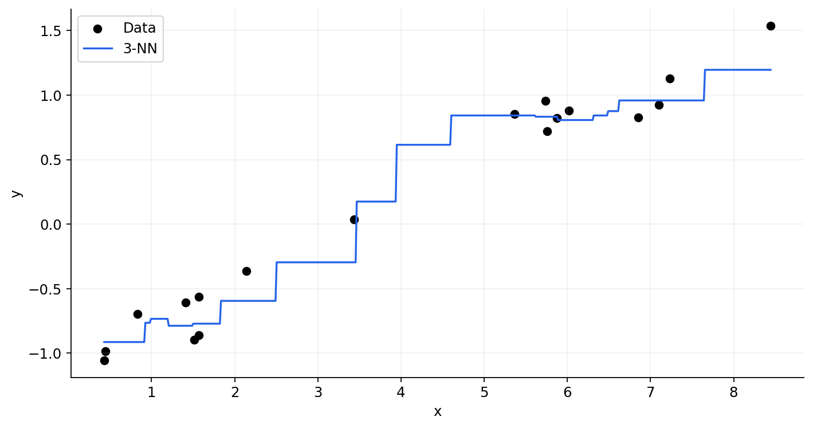
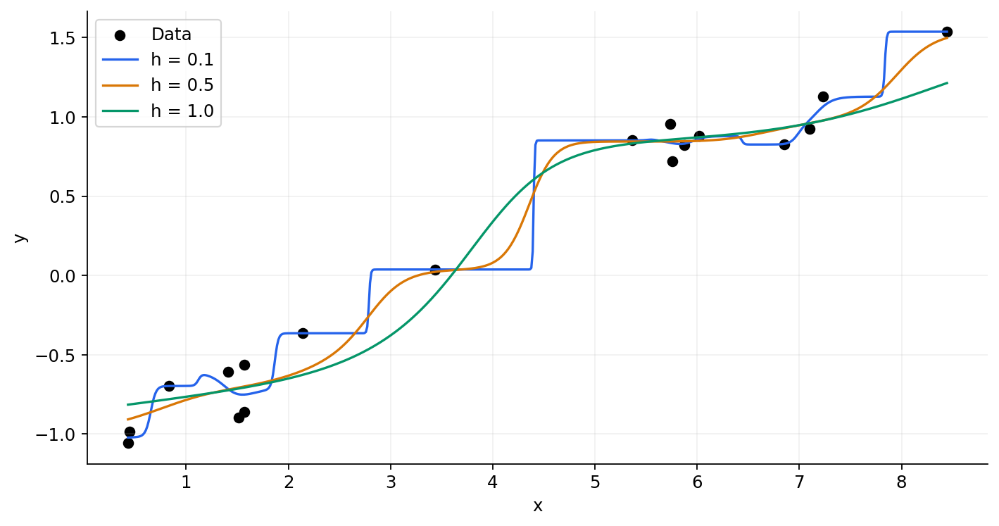
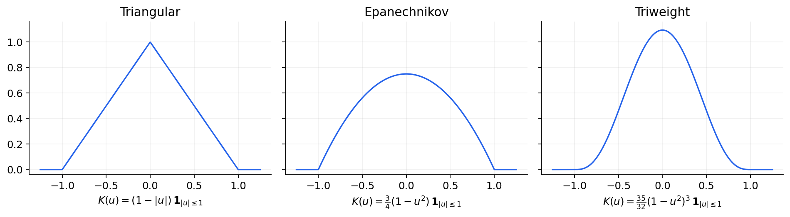
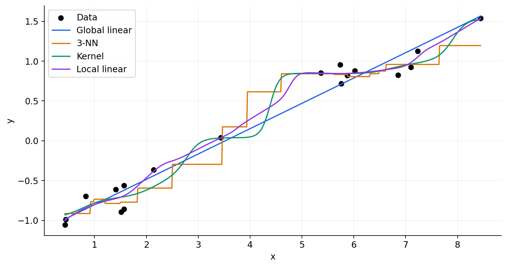

[← ST3131 course contents](/teaching/st3131/)

*Adapted from my notes on fitting curves through local regression.*

Suppose we have collected observations $(x_i,y_i)_{i=1}^n$, and a scatter plot suggests that $y$ follows some curve $f(x)$. How can we estimate that curve without deciding its entire shape in advance?

In ST3131, we usually start by choosing a model and estimating its coefficients. Here, let's explore another idea: **to predict at a particular location, pay more attention to the observations nearby.** We will start with neighbours, turn their contributions into smooth weights, and then use a Taylor expansion to connect the whole idea back to weighted least squares.

The main text contains the complete explanation and derivations. **Every Python example and its code walkthrough is optional:** open the bordered boxes whenever you want to implement an idea. You can leave all of them closed and follow the theory from beginning to end.

## One curve, or many local questions?

Recall simple linear regression. If a straight line seems reasonable, we write $f(x)=\beta_0+\beta_1x$ and minimise


$$
\sum_{i=1}^n [y_i-f(x_i)]^2
=\sum_{i=1}^n[y_i-(\beta_0+\beta_1x_i)]^2.
$$


If the relationship bends, we could instead use a polynomial, $f(x)=\beta_0+\beta_1x+\cdots+\beta_px^p$. Either way, after choosing the degree, the fitting problem reduces to estimating a fixed number of coefficients. Once we have them, we can make predictions without returning to the original observations.

Now notice something about that loss: every observation receives the same weight. What if our question is specifically **“what is $f(x)$ at this particular $x$?”** Perhaps observations close to $x$ deserve more attention than those far away.

Throughout this article, $x$ is the **evaluation point**, while $x_i$ is the location of training observation $i$. We hold $x$ fixed, estimate $f(x)$, and then move to the next evaluation point. Each location gets its own local calculation.

## Start with the nearest neighbours

The simplest version is $k$-nearest-neighbour regression. Find the $k$ training observations closest to $x$, and average their responses:


$$
\hat f(x)=\sum_{i=1}^n c_i(x)y_i,
\qquad
c_i(x)=\begin{cases}
1/k,&x_i\text{ is one of the }k\text{ nearest neighbours of }x,\\
0,&\text{otherwise.}
\end{cases}
$$


The numbers $c_i(x)$ are **smoothing weights**: they tell us how much each observed response contributes to the prediction. Here, selected neighbours share the weight equally; everyone else gets zero. We assume ties are resolved consistently.

Imagine sliding $x$ slowly from left to right. As long as the selected neighbours stay the same, their average stays the same. When one neighbour leaves and another enters, the prediction can jump. This explains the steps in the fitted curve below.



So we have a useful local estimator, but its fitted curve is generally discontinuous. **Could we let an observation's contribution fade gradually instead of switching it on or off?**

<details class="optional-code" style="border:1px solid #94a3b8;border-radius:10px;padding:1rem 1.25rem;margin:1.5rem 0;">
<summary style="cursor:pointer;font-weight:600;">Optional Python · Create the data and fit 3-NN — click to expand</summary>

Run the code boxes in order in one Python session. We use NumPy, Matplotlib and scikit-learn. This smooth simulated signal comes from the companion notebook; we keep the same data throughout so that the methods are easy to compare.

```python
import numpy as np
import matplotlib.pyplot as plt
from sklearn.neighbors import KNeighborsRegressor

np.random.seed(11)
x = np.sort(np.r_[
    np.random.uniform(0.4, 2.8, 8),
    np.random.uniform(3.1, 6.2, 6),
    np.random.uniform(6.8, 9.4, 4),
])

def true_signal(x):
    return (
        -1.05 + 0.18 * x
        + 1.25 / (1 + np.exp(-(x - 3.5) / 0.38))
        - 0.85 * np.exp(-((x - 6.4) / 1.0) ** 2)
        + 0.10 * np.sin(1.4 * x)
    )

y = true_signal(x) + np.random.normal(0, 0.16, size=len(x))
x_eval = np.linspace(x.min(), x.max(), 600)

knn = KNeighborsRegressor(n_neighbors=3, weights="uniform")
knn.fit(x.reshape(-1, 1), y)
y_knn = knn.predict(x_eval.reshape(-1, 1))

plt.scatter(x, y, color="black", label="Data")
plt.plot(x_eval, y_knn, label="3-NN")
plt.xlabel("x")
plt.ylabel("y")
plt.legend()
plt.show()
```

**Unpacking the code.** The seed makes the sample reproducible. The simulation produces 18 observations with uneven spacing. The evaluation grid is where we draw predictions; it is not additional training data. Scikit-learn expects a two-dimensional predictor array, so the reshaping turns a vector into a table with one column. At each grid location, the prediction is the average of three observed responses.

</details>

## From neighbours to kernel regression

A bell-shaped curve is a natural candidate for assigning nearby observations more weight. Let


$$
K(u)=\frac{1}{\sqrt{2\pi}}\exp(-u^2/2),
$$


the standard normal density. We use its shape as a weighting function; **this does not assume that our data or errors are normally distributed.**

Two ingredients are still missing. First, how quickly should the weights decrease with distance? Second, how do we make their sum equal to one, so that the prediction is a weighted average?

Introduce a **bandwidth** $h>0$ to control distance, and divide each weight by the total:


$$
c_i(x)=\frac{K((x-x_i)/h)}{\sum_{j=1}^nK((x-x_j)/h)},
\qquad
\hat f(x)=\sum_{i=1}^n c_i(x)y_i.
$$


Now the weights add to one. With the Gaussian kernel, the denominator is positive for every finite evaluation point in exact arithmetic, and the weights vary continuously with $x$. Their weighted sum therefore gives a continuous fitted curve.

### How local is local?

A small $h$ makes distance matter a lot: only very nearby observations receive appreciable weight. The fit can follow the data's bends quite sharply. A larger $h$ spreads the influence over a wider neighbourhood, producing a smoother-looking fit.



For a fixed evaluation point and fixed sample, increasing $h$ eventually makes all the Gaussian weights nearly equal. In the limit, the prediction approaches the overall sample mean. This gives a concrete meaning to “more uniform weights”.

Other kernels can play the same role. Here are three common choices. Our focus is the local-weighting idea, so we will keep the Gaussian kernel for the calculations rather than compare kernels in detail.



For a kernel that is zero outside a finite interval, we also need a nonzero total weight: there must be observations inside its window.

### A nonlinear curve can still be a linear smoother

For a fixed $x$, collect the smoothing weights into a row vector $\mathbf c(x)$. Then


$$
\hat f(x)=\mathbf c(x)\mathbf y,
\qquad \mathbf y=(y_1,\ldots,y_n)^\top.
$$


For $m$ evaluation points, stack those rows into a matrix:


$$
\begin{pmatrix}\hat f(x^{\mathrm{eval}}_1)\\\vdots\\\hat f(x^{\mathrm{eval}}_m)\end{pmatrix}
=
\underbrace{\begin{pmatrix}\mathbf c(x^{\mathrm{eval}}_1)\\\vdots\\\mathbf c(x^{\mathrm{eval}}_m)\end{pmatrix}}_{C\;:\;m\times n}
\mathbf y.
$$


This is why we call it a **linear smoother**. “Linear” describes its dependence on the observed responses, with predictor locations and bandwidth held fixed. It does not say that the fitted curve is a straight line in $x$! If we select the bandwidth using the responses, that complete selection-and-fitting procedure need not itself be linear in $\mathbf y$.

<details class="optional-code" style="border:1px solid #94a3b8;border-radius:10px;padding:1rem 1.25rem;margin:1.5rem 0;">
<summary style="cursor:pointer;font-weight:600;">Optional Python · Build kernel regression from scratch — click to expand</summary>

```python
def gaussian_kernel(u):
    return np.exp(-0.5 * u**2) / np.sqrt(2 * np.pi)

def kernel_reg(x_train, y_train, x_eval, h=1.0):
    D = x_eval[:, None] - x_train
    K = gaussian_kernel(D / h)
    C = K / K.sum(axis=1, keepdims=True)
    return C @ y_train

plt.scatter(x, y, color="black", label="Data")
for h in [0.1, 0.5, 1.0]:
    plt.plot(x_eval, kernel_reg(x, y, x_eval, h), label=f"h = {h}")
plt.xlabel("x")
plt.ylabel("y")
plt.legend()
plt.show()
```

**Unpacking the code.** All inputs here are one-dimensional NumPy arrays, and the bandwidth is positive.

| Step | Shape | Meaning |
| --- | --- | --- |
| `x_eval[:, None] - x_train` | $(m,n)$ | Broadcasting creates every evaluation-to-training difference |
| `gaussian_kernel(D / h)` | $(m,n)$ | Each entry is an unnormalised kernel weight |
| `K.sum(axis=1, keepdims=True)` | $(m,1)$ | One total weight per evaluation point |
| `C` | $(m,n)$ | Divide each row by its own total; each row sums to one |
| `C @ y_train` | $(m,)$ | One weighted response average per evaluation point |

The normal density's constant factor cancels during normalisation. We retain it to match the formula. Very small bandwidths or evaluation points far outside the data can cause numerical underflow; these examples evaluate within the observed range at the displayed bandwidths.

</details>

## Why kernel regression is a local constant fit

So far, we seem to have invented the estimator by choosing convenient weights. Can we get it by minimising a loss, as we did in linear regression?

Fix an evaluation point $x$, and define **loss weights**


$$
w_i(x)=K\!\left(\frac{x-x_i}{h}\right).
$$


We would like nearby observations to matter more in the squared-error loss:


$$
\sum_{i=1}^n w_i(x)[y_i-f(x_i)]^2.
$$


But we still need to specify what sort of function we fit locally. Start with the simplest approximation: **near $x$, the function is roughly constant**, so $f(x_i)\approx f(x)$. Since $x$ is fixed, its unknown function value is just one unknown number. Call that number $\beta_0$.

The local fitting problem becomes


$$
\min_{\beta_0}\sum_{i=1}^n w_i(x)(y_i-\beta_0)^2.
$$


Differentiate and set the derivative to zero:


$$
-2\sum_i w_i(x)(y_i-\hat\beta_0)=0
\quad\Longrightarrow\quad
\hat f(x)=\hat\beta_0
=\frac{\sum_i w_i(x)y_i}{\sum_j w_j(x)}.
$$


There it is: exactly the kernel regression estimator. **Kernel regression is the weighted least-squares fit of a local constant.**

Keep the two types of weights separate. The loss weights $w_i(x)$ determine how much each squared residual matters. The smoothing weights $c_i(x)$ determine how much each response contributes to the final prediction. For local constant regression, the latter are simply the normalised former.

### Are we really assuming every function value is the same?

That would be a rather bold assumption! The kernel is what makes the approximation local. Faraway points receive very little weight, so the fit mainly asks for an approximately constant function in the neighbourhood that matters.

For example, take predictor locations $-3,0,3$, evaluate at $x=0$, and use $h=1$. The Gaussian loss weights are approximately


$$
(w_1,w_2,w_3)=(0.00443,\;0.39894,\;0.00443),
$$


which give smoothing weights of approximately $(1.09\%,97.83\%,1.09\%)$. Almost all the influence comes from the observation at zero.

And “local constant” does **not** mean the entire fitted curve is constant. We fit a different constant when we move the evaluation point. The resulting collection of predictions can trace a curve.

Bandwidth controls how wide this neighbourhood is. Like $k$ in k-NN, it is a tuning parameter, commonly selected using cross-validation. We will leave that selection procedure outside the scope of this note.

## Let the local fit have a slope

A constant approximation ignores the direction in which the function is moving. What if we allow a straight line within the neighbourhood?

A first-order Taylor approximation around the evaluation point gives


$$
f(x_i)\approx f(x)+f'(x)(x_i-x).
$$


This is a local statement: a sufficiently smooth curve can look approximately like its tangent when we zoom in. Kernel weights reduce the influence of distant observations, where that approximation may be poor.

Write $d_i=x_i-x$, $\beta_0=f(x)$ and $\beta_1=f'(x)$. Our new problem is


$$
\min_{\beta_0,\beta_1}
\sum_{i=1}^n w_i(x)[y_i-(\beta_0+\beta_1d_i)]^2.
$$


Does this look familiar? It is weighted least squares, with the **centred distances** $d_i$ as the predictor.

The centring is useful for interpretation. At the evaluation point itself, the distance is zero. The fitted local line therefore predicts $\hat\beta_0(x)$ there, so


$$
\hat f(x)=\hat\beta_0(x).
$$


We also obtain a local slope $\hat\beta_1(x)$, which estimates $f'(x)$ under the local approximation. It need not equal the derivative of the final fitted curve exactly, because moving $x$ also changes the weights and the fit.

### The familiar WLS matrix solution

For each fixed evaluation point, construct


$$
X(x)=\begin{pmatrix}1&x_1-x\\\vdots&\vdots\\1&x_n-x\end{pmatrix},
\qquad W(x)=\operatorname{diag}(w_1(x),\ldots,w_n(x)).
$$
$$
\hat{\boldsymbol\beta}(x)
=[X(x)^\top W(x)X(x)]^{-1}X(x)^\top W(x)\mathbf y.
$$


This formula assumes that the weighted design has full column rank. We need enough distinct predictor locations with effective weight to identify a local intercept and slope; an extremely narrow neighbourhood can make the calculation unstable.

Take the first entry of the coefficient vector to predict at $x$. Then move $x$ and repeat. Local linear regression fits a straight line in each neighbourhood, but those lines change from place to place, so the final fitted curve need not be straight.

It is also a linear smoother:


$$
\hat f(x)=
\underbrace{\begin{pmatrix}1&0\end{pmatrix}
[X^\top WX]^{-1}X^\top W}_{\mathbf c(x)}\mathbf y.
$$


The weights are less immediately recognisable than in kernel regression, but the same structure remains: a weighted combination of observed responses. For several evaluation points, we can again stack these rows.

<details class="optional-code" style="border:1px solid #94a3b8;border-radius:10px;padding:1rem 1.25rem;margin:1.5rem 0;">
<summary style="cursor:pointer;font-weight:600;">Optional Python · Fit all the local WLS problems — click to expand</summary>

```python
def local_reg(x_train, y_train, x_eval, h=1.0):
    D = x_train - x_eval[:, None]
    W = gaussian_kernel(D / h)
    X = np.stack([np.ones_like(D), D], axis=2)
    XtWX = np.einsum("mni,mn,mnj->mij", X, W, X)
    XtWy = np.einsum("mni,mn,n->mi", X, W, y_train)
    beta = np.linalg.solve(XtWX, XtWy[..., None])
    return beta[..., 0, 0]
```

**Unpacking the code.** This implements the matrix calculation for all $m$ evaluation points at once. The Gaussian kernel is symmetric, so reversing the difference sign leaves its weights unchanged. The design matrix does need the stated sign: training location minus evaluation location.

| Variable | Shape | Meaning |
| --- | --- | --- |
| `D`, `W` | $(m,n)$ | Centred predictors and loss weights for every evaluation point |
| `X` | $(m,n,2)$ | One two-column design matrix per evaluation point |
| `XtWX` | $(m,2,2)$ | One weighted normal-equation matrix per evaluation point |
| `XtWy` | $(m,2)$ | One weighted response vector per evaluation point |
| `XtWy[..., None]` | $(m,2,1)$ | The same vectors with an explicit right-hand-side column |
| `beta` | $(m,2,1)$ | The intercept and slope for each local fit |

The first `einsum` sums over observations while retaining the evaluation-point axis and the two coefficient axes. It computes the weighted cross-products without constructing $m$ large diagonal matrices. The second does the corresponding weighted predictor-response products.

`np.linalg.solve` solves the batch of systems with one right-hand-side column each. The coefficient matrices are $2\times2$ and the right-hand sides are $2\times1$; they do not have to have identical shapes. We solve the equations directly instead of explicitly computing matrix inverses. Finally, `beta[..., 0, 0]` extracts each intercept, which is the prediction at that fit's centre.

</details>

### Compare the fitted curves

Here are global linear regression, 3-NN, kernel regression and local linear regression on the same sample. The last two use the same Gaussian kernel and bandwidth, so their difference comes from fitting a local constant versus a local line.



The global straight line cannot follow every bend. The neighbour average makes steps. Kernel regression smooths the transitions, and local linear regression can also adapt to a slope within each neighbourhood. This is an illustration of their behaviour on one sample, rather than a claim that one method always gives the best fit.

<details class="optional-code" style="border:1px solid #94a3b8;border-radius:10px;padding:1rem 1.25rem;margin:1.5rem 0;">
<summary style="cursor:pointer;font-weight:600;">Optional Python · Reproduce the model comparison — click to expand</summary>

```python
h = 0.42
coef = np.polyfit(x, y, deg=1)
y_linear = np.polyval(coef, x_eval)
y_kernel = kernel_reg(x, y, x_eval, h=h)
y_local = local_reg(x, y, x_eval, h=h)

plt.scatter(x, y, color="black", label="Data")
for values, label in [
    (y_linear, "Global linear"),
    (y_knn, "3-NN"),
    (y_kernel, "Kernel"),
    (y_local, "Local linear"),
]:
    plt.plot(x_eval, values, label=label)
plt.xlabel("x")
plt.ylabel("y")
plt.legend()
plt.show()
```

**Unpacking the code.** Every model sees the same training sample and predicts on the same grid. The polynomial fit has degree one, so it supplies the ordinary global straight-line comparison. Both local methods use the bandwidth specified at the top. The kernel here is the standard normal density, consistently using the factor one-half in its exponent.

</details>

## A deeper look: how local linear regression changes the weights

Let's make the smoothing weights explicit. This final derivation uses only differentiation and a two-equation linear system.

Fix $x$ and abbreviate $w_i=w_i(x)$ and $d_i=x_i-x$. Differentiate the local linear loss with respect to both coefficients and set the derivatives to zero:


$$
\begin{aligned}
\sum_i w_i\hat\beta_0+\sum_i w_id_i\hat\beta_1&=\sum_i w_iy_i,\\
\sum_i w_id_i\hat\beta_0+\sum_i w_id_i^2\hat\beta_1&=\sum_i w_id_iy_i.
\end{aligned}
$$


Only the two coefficients are unknown. Everything else is calculated from the observations and their distances to $x$. To make the algebra easier to read, define


$$
S_0=\sum_iw_i,\qquad S_1=\sum_iw_id_i,\qquad S_2=\sum_iw_id_i^2,
$$
$$
T_0=\sum_iw_iy_i,\qquad T_1=\sum_iw_id_iy_i.
$$


The equations reduce to


$$
\begin{cases}
S_0\hat\beta_0+S_1\hat\beta_1=T_0,\\
S_1\hat\beta_0+S_2\hat\beta_1=T_1.
\end{cases}
$$


Multiply the first equation by $S_2$ and the second by $S_1$, then subtract to eliminate the slope. Provided $S_0S_2-S_1^2>0$, we obtain


$$
\hat\beta_0=\frac{S_2T_0-S_1T_1}{S_0S_2-S_1^2}.
$$


Finally, substitute the sums defining $T_0$ and $T_1$:


$$
\hat f(x)=\hat\beta_0
=\sum_i\underbrace{\frac{(S_2-S_1d_i)w_i}{S_0S_2-S_1^2}}_{c_i(x)}y_i.
$$


Now we can compare the two smoothers directly:

| Method | Smoothing weight |
| --- | --- |
| Local constant / kernel regression | $c_i(x)=w_i/S_0$ |
| Local linear regression | $c_i(x)=(S_2-S_1d_i)w_i/(S_0S_2-S_1^2)$ |

Both begin with the same kernel loss weights. Allowing a local slope changes how those weights translate into contributions to the prediction: the correction uses the weighted distances around the evaluation point.

For example, if $S_1=0$, the weighted distances balance around zero and the local linear weights reduce to $w_i/S_0$. At that evaluation point, the two intercept estimates agree. When they do not balance, the slope adjustment matters.

The local linear smoothing weights still sum to one, since summing their numerators gives $S_2S_0-S_1^2$. However, individual weights can be negative. So this remains a linear combination of responses, but it is not necessarily a weighted average with nonnegative weights. The loss weights themselves are still nonnegative.

## The cost of asking a new question at every point

In global polynomial regression, we estimate one coefficient vector and reuse it. In these local methods, each evaluation point changes the distances and weights; local linear regression also requires a new small WLS calculation.

For the direct implementations here, $m$ evaluation points and $n$ training observations involve $mn$ distance-and-weight calculations. Batch operations can make the computation fast, but arrays holding all those combinations consume memory. Adding polynomial terms or more predictors makes the local design arrays larger still.

Processing one evaluation point at a time reduces peak memory, but a Python loop may be slower. Another practical compromise is to fit on a coarser evaluation grid and linearly interpolate between those predictions. That saves work at the price of an approximation between grid locations.

The connection to ST3131 is that we have not abandoned least squares. We have changed **where** we fit and **how much influence** each observation has. A local constant gives kernel regression; a local first-order Taylor approximation gives local linear regression. The final curve is assembled by moving the centre and repeating that familiar fitting problem.

[← ST3131 course contents](/teaching/st3131/)
