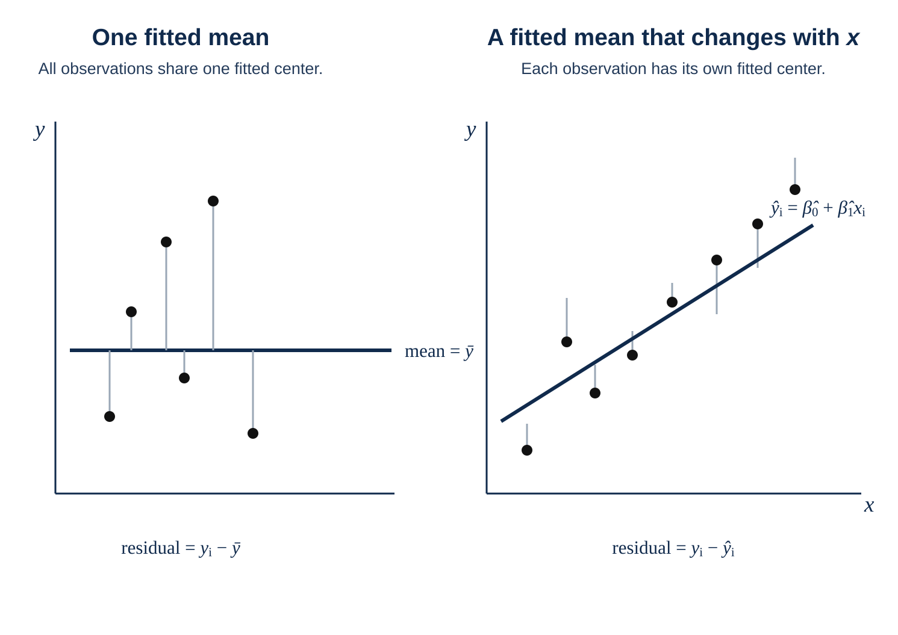

[← ST3131 course contents](/teaching/st3131/)

Suppose we collect data \(Y_1,\ldots,Y_n\) from a population with mean \(\mu\) and variance \(\sigma^2\), and we are interested in the population variance. We usually use the sample variance \(S^2=\frac{1}{n-1}\sum_{i=1}^{n}(Y_i-\bar Y)^2\) to estimate \(\sigma^2\). In [Why n − 1 in Sample Variance?](/teaching/why-n-minus-one/), we explained why the sample variance is divided by \(n-1\), rather than \(n\). The idea is simple:

- If we knew the population mean, we could use \(\frac{1}{n}\sum_{i=1}^{n}(Y_i-\mu)^2\).

- But we do not know it, so we replace it with \(\bar Y\): \(\frac{1}{n}\sum_{i=1}^{n}(Y_i-\bar Y)^2\).

- Finally, because \(\bar Y\) is calculated after looking at this particular sample, it naturally moves closer to the observations. As a result, \(Y_i-\bar Y\) looks a little smaller than the true deviation, which makes us underestimate the population variance. The \(n-1\) in \(S^2=\frac{1}{n-1}\sum_{i=1}^{n}(Y_i-\bar Y)^2\) corrects this underestimation.

Now let us bring the same question into simple linear regression. Suppose we want to study the relationship between \(x\) and \(Y\). For example, \(x\) might be study time and \(Y\) might be an exam score. Our data are now pairs \((x_i,Y_i)\), rather than \(Y\) alone. A student who studies for one hour and a student who studies for ten hours should not be expected to have the same average score. So, if \((x,Y)\) appears to have a linear relationship, we can introduce the following linear model:

\[
Y_i=\beta_0+\beta_1x_i+\varepsilon_i,
\qquad
\varepsilon_i\sim N(0,\sigma^2).
\]

This is saying:

\[
Y_i\mid x_i\sim N(\beta_0+\beta_1x_i,\sigma^2). \tag{1}
\]

More directly, there are two points: 1. different \(x_i\)'s have different means, \(\beta_0+\beta_1x_i\); 2. their variation around their respective means is described by the same \(\sigma^2\). So how should we estimate \(\sigma^2\) in this setting?

## From \(S^2\) to \(\mathrm{MS}_{\mathrm{Res}}\)

Because \(x\) is now part of the model, the sample variance \(S^2=\frac{1}{n-1}\sum_{i=1}^{n}(Y_i-\bar Y)^2\) used in ST2132 no longer fits this setting. Equation (1) tells us that \(Y_i-\beta_0-\beta_1x_i\sim N(0,\sigma^2)\), so let us try using \(Y_i-\beta_0-\beta_1x_i\) to estimate \(\sigma^2\):

- If we knew the true \(\beta_0\) and \(\beta_1\), we could use \(\frac{1}{n}\sum_{i=1}^{n}(Y_i-\beta_0-\beta_1x_i)^2\) as an estimate of \(\sigma^2\).

- But we do not know them, so we replace them with the SLR estimates \(\hat\beta_0\) and \(\hat\beta_1\): \(\frac{1}{n}\sum_{i=1}^{n}(Y_i-\hat\beta_0-\hat\beta_1x_i)^2\).

- Finally, \(\hat\beta_0\) and \(\hat\beta_1\) are calculated after looking at this particular sample, so they also move toward the observations. As a result, \(Y_i-\hat\beta_0-\hat\beta_1x_i\) looks smaller than the true deviation and underestimates the population variance. That is why we use

  \[
  \mathrm{MS}_{\mathrm{Res}}
  =\frac{\mathrm{SS}_{\mathrm{Res}}}{n-2}
  =\frac{1}{n-2}\sum_{i=1}^{n}
  (Y_i-\hat\beta_0-\hat\beta_1x_i)^2.
  \]

  The \(n-2\) is what corrects this underestimation.

## Why \(n-2\)?

What we really want is \(\frac{1}{n}\sum_{i=1}^{n}(Y_i-\beta_0-\beta_1x_i)^2\). But the true intercept and slope are unknown, so we estimate them from the data and use those estimates instead. This is where the fitted line can chase the observations in two ways:

- The intercept can move the whole line up or down.
- The slope can rotate the line to follow the overall trend in the data.

So the fitted line absorbs some of the variation that originally belonged to the random errors. Just as \(\bar Y\) chased the sample in the ST2132 setting without \(x\), the residuals here are also made smaller by the fitted line.

Here is one way to picture it: we start with \(n\) directions of random variation. After fitting a line, two of those directions have been used up—one for the intercept and one for the slope.

\[
\underbrace{n\text{ variation directions}}_{\text{true errors}}
\quad\longrightarrow\quad
\underbrace{2\text{ absorbed by the fitted line}}_{\text{intercept and slope}}
\quad+
\underbrace{n-2\text{ left in the residuals}}_{\text{remaining variation}}.
\]

Therefore, the residual sum of squares averages only \((n-2)\sigma^2\). If we continue to divide by \(n\), the result is too small. Dividing by the remaining \(n-2\) corrects this underestimation.

## The same idea

In the ST2132 sample variance, we estimate one unknown population mean. \(\bar Y\) uses up one direction, leaving \(n-1\).

In ST3131, \(\mathrm{MS}_{\mathrm{Res}}\) for SLR uses \(n-2\). For MLR, \(\mathrm{MS}_{\mathrm{Res}}\) uses \(n-p\): the model estimates \(p-1\) covariate coefficients plus one intercept, and uses those parameters to follow the data.

That is why the denominator is not a mysterious rule from a textbook. It reminds us how much information the model has used to adapt itself to the data.
