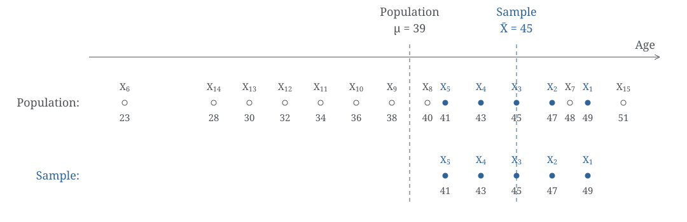

[← All teaching](/teaching/)

*Adapted from a student's question in NUS ST2132.*

Suppose our population consists of one million people who voted for Trump in the 2024 election. We want to know: roughly how old are they on average? And is their age distribution fairly concentrated, or is there a wide mix of younger and older voters?

In statistical terms, we are interested in the population mean \(\mu\) and variance \(\sigma^2\). But we can’t possibly ask all one million people, so here’s what we do:

We use the numbers calculated from our sample—say, \(\bar x=45\) and \(s^2=10\)—to estimate the mean \(\mu\) and variance \(\sigma^2\) of this population of one million people. Now here comes the question:

> **Why is the denominator in \(S^2\) equal to \(5-1\)? Or more generally, why define**

\[
S^2=\frac{1}{\color{red}{\boldsymbol{n-1}}}\sum_{i=1}^{n}(X_i-\bar X)^2?
\]

---

To make the picture easier to draw, let's represent the population with 15 points (we're not drawing a million dots!). We sample five people, as shown below:

The population's average age \(\mu\) is 39, and the ages are quite spread out. Now that we have sampled \((X_1,\ldots,X_5)\), we can naturally look at how far each person in our sample is from the **true population mean**:

\[
\begin{pmatrix}
X_1-\mu\\
X_2-\mu\\
\vdots\\
X_5-\mu
\end{pmatrix}
\xrightarrow{\text{square, then average}}
\frac{(X_1-\mu)^2+\cdots+(X_5-\mu)^2}{5},
\]

and use this to estimate the population variance \(\sigma^2\). This makes perfect sense: **if we knew \(\mu\), dividing by \(n\) (five here) would be absolutely fine.**

But here's the trouble: we don't know \(\mu\)! It's the mean of all one million people, after all. So a natural thought is: we're already using \(\bar X\) to estimate \(\mu\), so why not replace \(\mu\) with \(\bar X\) here too? That gives us our first step:

\[
\frac{1}{n}\sum_{i=1}^{n}(X_i-\mu)^2
\;\xrightarrow[\text{replace }\mu\text{ with }\bar X]{\text{Revision}}\;
\underset{\star}{\underline{\frac{1}{n}\sum_{i=1}^{n}(X_i-\bar X)^2}}.
\]

A small problem has quietly slipped in. We wanted to measure “how far the sample is from the population's average age \(\mu\).” But \(\bar X\) isn't the population's centre: it is chosen **after seeing our sample** \(X_1,\ldots,X_5\). In our example, \(\bar X=45\). Look back at the picture: it's pretty close to the five sampled people, isn't it? It makes us think, “Hmm, these people—the solid blue dots ●—don't seem all that spread out.” Yet in this example, the population, including the hollow grey dots ○, is much more spread out than our sample.

So think of it this way: the true mean \(\mu\) stays put, while the sample mean \(\bar X\) **“chases after our sample.”** If we happen to sample a younger group today, \(\bar X\) moves towards the younger ages. If we happen to sample an older group tomorrow, \(\bar X\) moves towards the older ages instead. So using \(\underline{\star}\) to estimate the population's spread tends to underestimate it, on average. This brings us to the next step:

\[
\underset{\star}{\underline{\frac{1}{n}\sum_{i=1}^{n}(X_i-\bar X)^2}}
\;\xrightarrow[\text{divide by }n-1\text{ instead}]{\text{Revision}}\;
\frac{1}{n-1}\sum_{i=1}^{n}(X_i-\bar X)^2.
\]

For our five-person sample, we go from dividing by five to dividing by four. This makes the estimate a little bigger, <mark style="background-color: #fff3b0; color: #222;">to offset the underestimation caused by using \(\bar X\)</mark>—and that answers our opening question.

---

**A small remark.** How much does \(\underline{\star}\) underestimate the variance, exactly? We can describe this using the mathematical language of ST2131: expectation. With independent, identically distributed observations of finite variance, a little calculation gives:

\[
\begin{aligned}
E\!\left[\underline{\star}\right]
&=E\!\left[\frac{1}{n}\sum_{i=1}^{n}(X_i-\bar X)^2\right]\\
&=\frac{1}{n}\sum_{i=1}^{n}E\!\left[(X_i-\bar X)^2\right]\\
&=\frac{1}{n}\sum_{i=1}^{n}E\!\left[\big[(X_i-\mu)+(\mu-\bar X)\big]^2\right]\\
&=\cdots=\frac{n-1}{n}\times\sigma^2.
\end{aligned}
\]

Don't worry—try expanding the square, treating each expression in parentheses as one piece!

This means that if we repeat the “sample just five people” experiment many times, \(\underline{\star}\) averages out to \(4/5=80\%\) of the true variance. If we repeat the “sample 100 people” experiment, it averages out to \(99/100=99\%\). So as the sample size gets larger, dividing by \(n\) or \(n-1\) makes less and less difference.

---

## Let's try sampling!

This time, let's sample from \(N(0,10^2)\), so the true variance is **100**. Choose a sample size, draw ten samples, and see where the two estimates end up on average.

<link rel="stylesheet" href="simulation.css?v=2">

  

    <label for="vsim-size">Sample size</label>
    <select id="vsim-size"><option value="5">n = 5</option><option value="100">n = 100</option></select>
    <button id="vsim-sample" type="button">Sample</button>
    <button id="vsim-reset" class="vsim-secondary" type="button">Start again</button>
    0 / 10 samples
  

  <svg id="vsim-plot" viewBox="0 0 860 300" role="img" aria-labelledby="vsim-plot-title vsim-plot-desc">
    <title id="vsim-plot-title">Population and current sample</title>
    <desc id="vsim-plot-desc">The fixed population illustration combines all ten samples. Blue dots highlight the current sample in both rows. Dashed lines mark the true mean and sample mean.</desc>
  </svg>
  
○ Population illustration &nbsp; ● Current sample

  

    
Divide by n <strong id="vsim-current-n">—</strong>

    
Divide by n − 1 <strong id="vsim-current-corrected">—</strong>

  

  

    

      <table class="vsim-table">
        <caption>One column for each sample</caption>
        <colgroup><col style="width: 76px"><col span="10"><col style="width: 145px"></colgroup>
        <thead><tr><th scope="col">Estimate</th><th scope="col">1st</th><th scope="col">2nd</th><th scope="col">3rd</th><th scope="col">4th</th><th scope="col">5th</th><th scope="col">6th</th><th scope="col">7th</th><th scope="col">8th</th><th scope="col">9th</th><th scope="col">10th</th><th class="vsim-average-cell" scope="col"><button id="vsim-average" type="button" aria-label="Calculate average estimates" disabled>Average</button></th></tr></thead>
        <tbody>
          <tr id="vsim-row-n"><th scope="row">÷ n</th><td class="vsim-average-cell">avg⟶<strong id="vsim-average-n"></strong></td></tr>
          <tr id="vsim-row-corrected"><th scope="row">÷ (n − 1)</th><td class="vsim-average-cell">avg⟶<strong id="vsim-average-corrected"></strong></td></tr>
        </tbody>
        <tfoot><tr><td colspan="11"></td><td class="vsim-average-cell">True variance: 100</td></tr></tfoot>
      </table>
    

  

  
Click Sample to draw your first sample.

